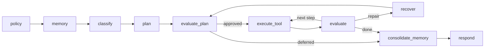

# NetZoo Agent 程式碼閱讀指南

這份指南給「看得懂基本 Python，但還不熟 LangGraph 或 NetZoo」的讀者。目標不是一次讀完
所有檔案，而是先建立一條穩定主線：**CLI 收到一句話，graph 如何安排節點，typed state
如何流動，最後哪個 adapter 執行工具並產生回覆。**

若要查完整架構與設計理由，再閱讀
[`NETZOO_HARNESS_ARCHITECTURE.md`](NETZOO_HARNESS_ARCHITECTURE.md)。

## 閱讀前只需知道四件事

1. **Router** 把自然語言分類成 `TaskDecision`，不直接執行 shell command。
2. **Planner** 把決策組成 `WorkflowPlan`；**Plan Evaluator** 是 Executor 前的安全閘門。
3. **LangGraph** 可先想成「依照 state 決定下一個 Python function 的流程圖」。
4. `scripts/netzoo_agent.py` 是舊入口的相容 facade；真正行為通常在
   `scripts/netzoo_agent_core/` 的 owner module。

先不要研究所有 Pydantic、LangChain 或 Network Zoo 細節。閱讀第一輪只追三個問題：

- 目前在哪一個節點？
- 此節點從 state 讀什麼、寫回什麼？
- 真正決策或 I/O 是委派給哪個 owner module？

## 15 分鐘主線

請依序讀以下檔案；每個檔案只看指定內容即可。

### 1. 相容入口（1 分鐘）

讀 `scripts/netzoo_agent.py`。

只看它匯入哪些 implementation modules，以及最後如何把 CLI 交給 core。這個檔案受 150 行
上限保護，不應再承載新功能。

### 2. CLI 總協調（1 分鐘）

讀 `scripts/netzoo_agent_core/cli/loop.py` 的 `run_cli()`。

它只做五件事：設定 runtime、處理立即命令、啟動 memory、載入 policy、進入 conversation。
參數解析在 `cli/arguments.py`，`--policy-status`、memory 與 preflight 命令在
`cli/commands.py`，依賴組裝在 `cli/bootstrap.py`。

### 3. 一輪對話（2 分鐘）

讀 `scripts/netzoo_agent_core/cli/conversation.py` 的 `run_conversation()`。

先只找：

- `HumanMessage(content=task)`：使用者文字進入 graph。
- `invoke_graph_turn_func(...)`：執行一輪 graph。
- `WorkflowPlan.model_validate(result["plan"])`：判斷是否需要補資料或確認偏好。
- `save_session(...)`：保存可續跑狀態。

clarification 與 follow-up 已各自拆到 `cli/clarification.py`、`cli/follow_up.py`，第一輪可以略過。

### 4. 整張流程圖（2 分鐘）

讀 `scripts/netzoo_agent_core/graph/topology.py` 的 `compile_graph()`。

這是最重要的導航地圖：節點名稱、固定 edge、conditional edge 都集中在這裡。



### 5. Router 與 Planner 節點（2 分鐘）

讀 `scripts/netzoo_agent_core/graph/routing_planning.py`。

- `classify_task()` 產生 `TaskDecision`；模型失敗時有 deterministic fallback。
- `plan_task()` 把 decision 交給真正 Planner，然後把 plan 寫回 state。

接著讀 `scripts/netzoo_agent_core/planning/builder.py`。這裡是 plan 建構入口；更細的 evidence、
assembly 與 rendering 分別在同資料夾，不需要一開始全部展開。

### 6. Executor 前的閘門（2 分鐘）

讀 `scripts/netzoo_agent_core/evaluation/plan_review.py`。

它驗證 `WorkflowPlan` 是否符合 workflow、required inputs、step order 與 policy。具體規則在
`evaluation/plan_rules.py`。若 plan 被拒絕，應先從這兩個 owner 查，不要直接改 graph edge。

### 7. 執行與結果評估（2 分鐘）

先讀 `scripts/netzoo_agent_core/graph/execution.py`，理解四個 graph node：

- evaluate plan
- execute tool
- evaluate result
- recover

再讀 `scripts/netzoo_agent_core/execution.py`。這裡把已核准 step 轉成 PANDA、PUMA、LIONESS、
CONDOR 等 adapter 呼叫。裝飾過的 LangChain tool 集中在
`scripts/netzoo_agent_core/tool_adapters.py`；純資料驗證不放在此層。

### 8. 回覆（1 分鐘）

讀 `scripts/netzoo_agent_core/graph/response.py`。

它把 plan、tool result、evaluation 與 memory context 組成使用者最後看到的回答。若只是顯示
文字或語言不正確，再往 `presentation.py` 與 `evaluation/rendering.py` 查。

每個 deterministic 回覆另帶 `reply_kind`；`scripts/netzoo_agent_core/reply_cards/` 由同一個 decision
推出「卡片」（結論、重點、選項、無法執行的相關項目、下一步），只影響顯示。選項被選到時由
`engine/choices.py` 轉成 machine 本來就接受的文字；終端版的呈現在 `cli/terminal_cards.py`。

### 9. 第二輪才讀 memory 與 data（2 分鐘）

- `scripts/netzoo_agent_core/memory/episodes.py`：episode search、retention、寫入。
- `scripts/netzoo_agent_core/memory/profiles.py`：需確認的長期偏好。
- `scripts/netzoo_agent_core/memory/storage.py`：JSON persistence 與序列化。
- `scripts/netzoo_agent_core/data/tables.py`：純表格與 biological ID 驗證。
- `scripts/netzoo_agent_core/data/transforms.py`：expression/co-expression 純轉換流程。
- `scripts/netzoo_agent_core/data/discovery.py`：候選檔案關鍵字、評分與選擇。

`data/table_validation.py` 與 `data/preparation.py` 是舊 import 的相容 facade；要修改實際邏輯，
應進入上述 owner module。

## 用一個 PANDA 請求追 state

以下請求可當成閱讀時的固定案例：

```text
Run PANDA using data/expression.tsv, data/motif.tsv, and data/ppi.tsv; write outputs/panda.tsv.
```

資料會大致依下列型別流動：

| 階段 | 主要資料 | 要回答的問題 |
|---|---|---|
| CLI | `HumanMessage` | 原始請求如何進入 `messages`？ |
| Router | `TaskDecision` | action 是否為 PANDA？路徑抽取到哪些欄位？ |
| Planner | `WorkflowPlan` | evidence 是否齊全？steps 與 output 是什麼？ |
| Plan Evaluator | `PlanEvaluationResult` | required inputs、policy、順序是否通過？ |
| Executor | `ToolExecutionResult` | 實際或 dry-run command、stdout、artifact 是什麼？ |
| Result Evaluator | `EvaluationResult` | 下一步、完成、失敗或 recovery？ |
| Memory | profile、episodes | 有哪些已確認偏好或可重用經驗？ |
| Response | messages | 如何把結構化結果轉成最終文字？ |

型別定義集中在 `scripts/netzoo_agent_core/contracts/`：

- `contracts/decisions.py`：Router 與 task decisions
- `contracts/planning.py`：evidence、steps、plan
- `contracts/results.py`：plan/tool/result evaluations
- `contracts/state.py`：整個 `AgentState`
- `contracts/memory.py`：profile 與 episode schema

閱讀時可以在每個 graph node 找 `return {...}`；那些 key 就是此節點寫回 state 的欄位。

## 問題到 owner module 的地圖

| 症狀／需求 | 第一站 | 再往下看 |
|---|---|---|
| CLI flag 無效、退出碼錯誤 | `cli/commands.py`、`cli/loop.py` | `cli/arguments.py`、`cli/bootstrap.py` |
| 互動、resume、補資料卡住 | `cli/conversation.py` | `cli/clarification.py`、`session.py` |
| Router 選錯 workflow | `graph/routing_planning.py` | `routing/`、`interpretation/hydration.py` |
| 自動找到錯誤檔案 | `data/discovery.py` | `interpretation/discovery.py`、`routing/discovery.py` |
| plan 缺 step 或 evidence | `planning/builder.py` | `planning/assembly.py`、`planning/evidence.py` |
| plan 被錯誤拒絕 | `evaluation/plan_review.py` | `evaluation/plan_rules.py`、`workflows/*.yaml` |
| graph 跳錯節點 | `graph/topology.py` | `graph/transitions.py` |
| 工具參數或命令錯誤 | `execution.py` | `tool_adapters.py`、`command.py` |
| delimiter、ID、表格方向錯誤 | `data/tables.py` | `data/inspection.py`、`netzoo_table_io.py` |
| expression 轉換錯誤 | `data/transforms.py` | `data/preparation.py`（僅相容 facade） |
| output path 或 artifact 錯誤 | `data/paths.py`、`data/artifacts.py` | `execution.py` |
| 偏好沒有保存 | `memory/profiles.py` | `memory/storage.py`、`graph/policy_memory.py` |
| episode 搜尋或清理錯誤 | `memory/episodes.py` | `memory/normalization.py`、`memory/storage.py` |
| 最後文字或語言錯誤 | `graph/response.py` | `presentation.py`、`evaluation/rendering.py` |
| 選項、重點卡片或下一步不對 | `reply_cards/builder.py` | `reply_cards/choices.py`、`engine/choices.py` |
| session 名稱、筆記、tag、模型、輸出資料夾 | `session_meta.py`、`session_outputs.py` | `server/history.py`、`server/app.py` |

## 常見修改方式

### 新增 CLI 命令

1. 在 `cli/arguments.py` 定義參數。
2. 在 `cli/commands.py` 實作立即命令，或在適當 owner 實作行為。
3. 讓 `cli/loop.py` 只做協調，不把命令細節塞回去。
4. 加 CLI lifecycle 測試，確認 one-shot、interactive 與 exit code。

### 修改既有 workflow 規則

1. 先找 `scripts/workflow_registry.py` 與對應 `workflows/*.yaml`。
2. 檢查 `planning/` 如何產生 steps。
3. 檢查 `evaluation/plan_review.py` 如何審查。
4. 只有執行參數真的改變時才修改 `execution.py`。

### 新增純資料驗證或轉換

1. 放進 `data/tables.py`、`data/transforms.py` 或新的同層 owner。
2. 參數要明確傳入；純資料層不要讀 CLI 或 LangGraph state。
3. 若需要 `@tool`，在 `tool_adapters.py` 包裝純函式。
4. 不要讓 `data/` 反向 import `graph`、`planning`、`execution` 或 `tool_adapters`。

### 修改 memory

1. schema 先看 `contracts/memory.py`。
2. profile 行為看 `memory/profiles.py`，episode 行為看 `memory/episodes.py`。
3. 共用正規化放 `memory/normalization.py`，檔案 I/O 放 `memory/storage.py`。
4. 保留舊 `from netzoo_agent_core.memory import ...` 的公開 interface。

## 第一輪可以跳過

- `__init__.py` 的 re-export 細節。
- `validation.py`、`preparation.py`、`bundles.py` 等相容 facade。
- tracing、pricing、token accounting 的全部實作。
- 每一條 biological table validation 規則。
- provider fallback 與所有錯誤文案。
- 測試 fixture 的完整資料內容。

先完成主線，再按實際問題回來查 owner；不要用資料夾順序從第一個檔案讀到最後一個。

## 實際閱讀技巧

從節點名稱找到定義與測試：

```bash
rg -n 'def (classify_task|plan_task|execute_tool|evaluate_result)' scripts tests
```

追一個 typed contract 的產生與消費位置：

```bash
rg -n 'WorkflowPlan|PlanEvaluationResult|ToolExecutionResult' scripts/netzoo_agent_core tests
```

只跑與目前 owner 最接近的測試：

```bash
python -m pytest tests/test_cli_lifecycle.py -q
python -m pytest tests/test_memory_package.py -q
python -m pytest tests/test_data_package.py -q
python -m pytest tests/test_agent_module_boundaries.py -q
```

查某個舊 facade 的真實來源：

```bash
rg -n '^from .* import|^__all__' scripts/netzoo_agent_core/data/table_validation.py
```

完整回歸：

```bash
python -m pytest -q
python -m compileall -q scripts
```

## 詞彙表

| 名詞 | 在本專案中的意思 |
|---|---|
| module | 一個具明確責任的 Python 檔案或 package。 |
| interface | 其他模組應依賴的少量公開函式、class 或 typed contract。 |
| seam | 可獨立測試或替換的責任邊界，例如 Planner 與 Plan Evaluator 之間的 `WorkflowPlan`。 |
| adapter | 把核心資料轉成外部框架、CLI、檔案或 command 所需形狀的薄層。 |
| Router | 理解請求並產生 `TaskDecision` 的階段。 |
| Planner | 把決策與 evidence 組成 `WorkflowPlan` 的階段。 |
| Plan Evaluator | Executor 前的 gate，拒絕不安全或不完整 plan。 |
| Executor | 執行已核准 workflow step 的階段。 |
| Result Evaluator | 判斷 step 結果應繼續、完成、失敗或 recovery。 |
| Graph state | LangGraph 節點共同讀寫的 typed 工作狀態 `AgentState`。 |
| episode memory | 一次任務的 compact 結果摘要，用於之後檢索，不是完整聊天紀錄。 |

最後的導航原則只有一句：**先讀 `graph/topology.py` 找階段，再沿 typed state 找 owner
module；不要在 facade 或巨量全域搜尋結果裡直接修改。**
