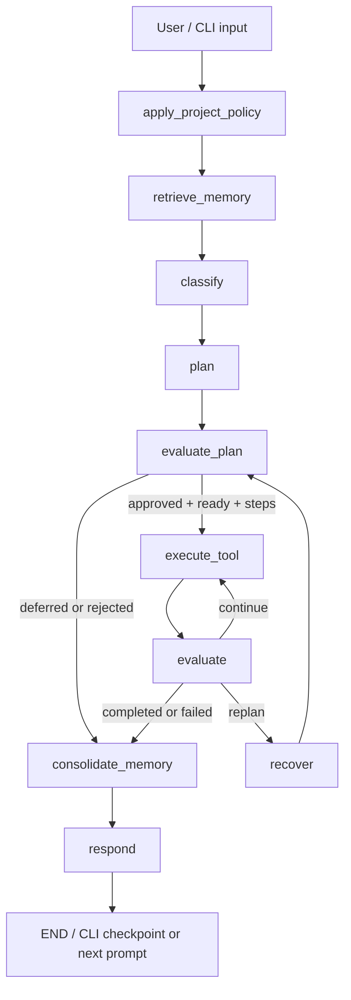

# NetZoo Agent 完整架構與實作導覽

本文件說明目前 NetZoo agent 已完成的功能、程式碼分層、資料契約，以及一個使用者請求
如何經過 Router、Planner、Plan Evaluator、Executor、Result Evaluator、Memory 和 CLI。
閱讀完本文件後，應能回答下列問題：

- 一個自然語言請求如何變成可執行、可稽核的 workflow？
- Planner 產生的 plan 如何傳給 Plan Evaluator？
- Plan Evaluator 如何保證 Executor 不能繞過 required inputs、allowlist 和 step order？
- Executor 的文字輸出如何變成 typed result，再交給 Result Evaluator？
- 缺少輸入、偏好確認、dry-run、失敗與 recovery 分別如何處理？
- 每一份 Python module 負責什麼，以及新增 workflow 時應修改哪裡？

若是第一次接觸這份 code，請先走
[`CODE_READING_GUIDE.md`](CODE_READING_GUIDE.md) 的 15 分鐘主線；本文件再用來查完整設計、
資料契約與治理細節。

---

## 1. 系統定位

目前系統是一個受規則約束、有狀態、可中斷續跑、具有受治理長期記憶的 NetZoo
workflow harness。它整合：

- PANDA
- PUMA
- LIONESS-PANDA
- LIONESS-PUMA
- LIONESS co-expression
- CONDOR
- Context7 文件查詢
- Websearch 查詢

它不是讓一個 LLM 自由決定 shell command。LLM 主要負責理解使用者意圖與產生一般文字
回答；所有本機工具權限、required inputs、step sequence、input validation、output safety
和 recovery 都由 Python typed contracts 與 allowlist 強制執行。

Planner、Plan Evaluator、Executor 與 Result Evaluator 是同一個 LangGraph 裡權責分離的
節點，不是四個各自啟動、互相聊天的 LLM sub-agent。這個選擇讓目前線性的 NetZoo
workflow 更可重現、成本更低，也更容易測試。

---

## 2. 重構後的檔案結構

原本 `scripts/netzoo_agent.py` 同時包含資料模型、routing、planning、I/O、執行、
evaluation、memory、session 與 CLI，共 7,626 行。重構後它是限制在 150 行以內的相容入口；
實作位於 `scripts/netzoo_agent_core/`，並依照「契約、資料、工作流程、介面」分層。

```text
scripts/
├── netzoo_agent.py                  # 舊 CLI/import 相容 facade
├── workflow_registry.py             # action 與 workflow 的單一 Python registry
├── netzoo_table_io.py               # 共用表格讀取與 delimiter 判斷
└── netzoo_agent_core/
    ├── __init__.py                  # 新程式應使用的精簡公開 interface
    ├── contracts/                   # typed contracts；__init__ 保留舊 import interface
    │   ├── decisions.py             # Router、Task、Preference decisions
    │   ├── planning.py              # evidence、workflow step 與 plan
    │   ├── results.py               # plan/tool/result evaluation contracts
    │   ├── policy.py                # project policy contracts
    │   ├── memory.py                # profile 與 episode contracts
    │   └── state.py                 # LangGraph AgentState
    ├── settings.py                  # 常數與 process-wide runtime settings
    ├── framework_compat.py          # LangChain/LangGraph optional dependency bridge
    ├── presentation.py              # 共用語言與顯示政策
    ├── data/                        # 不依賴 orchestration 的資料底層
    │   ├── paths.py                 # output path 安全與 canonicalization
    │   ├── tables.py                # 純表格與 biological ID validation
    │   ├── transforms.py            # 純 expression/co-expression 轉換
    │   ├── discovery.py             # 候選檔案關鍵字、評分與選擇
    │   ├── inspection.py            # neutral input inspection
    │   ├── bundles.py               # PANDA/PUMA input bundles
    │   └── artifacts.py             # output artifact validation
    ├── tool_adapters.py             # LangChain @tool wrappers → data 純函式
    ├── validation.py                # 舊 import 相容 facade → data facade/tables
    ├── preparation.py               # 舊 import 相容 facade → data facade/transforms
    ├── bundles.py                   # 舊 import 相容 facade → data.bundles
    ├── artifact_validation.py       # 舊 import 相容 facade → data.artifacts
    ├── path_safety.py               # 舊 import 相容 facade → data.paths
    ├── runtime.py                   # 舊 process-wide 設定的相容橋接
    ├── memory/                      # 長期記憶公開 interface 與實作
    │   ├── profiles.py              # 確認式 UserProfile 行為
    │   ├── episodes.py              # episode search、retention 與寫入
    │   ├── normalization.py         # 共用文字與查詢正規化
    │   └── storage.py               # JSON persistence 與序列化
    ├── command.py                   # subprocess 與 dry-run command rendering
    ├── execution.py                 # PANDA/PUMA/LIONESS/CONDOR adapters
    ├── routing/                     # capability gate、retrieval、tool result normalization
    ├── policy.py                    # AGENTS.md/workflow YAML fail-closed loader
    ├── interpretation/              # deterministic hydration、repair、file discovery
    ├── planning/                    # evidence ledger 與 WorkflowPlan 建構
    ├── evaluation/                  # Plan Evaluator、Result Evaluator、recovery、renderer
    ├── llm.py                       # prompts、model allowlist、token budget
    ├── graph/                       # LangGraph nodes、edges、transitions、orchestration
    ├── session.py                   # resumable session 與 retention
    ├── interaction.py               # 舊 import 相容 facade → cli 子模組
    └── cli/                         # CLI interface 與生命週期
        ├── arguments.py             # 參數定義
        ├── commands.py              # policy/memory/preflight 立即命令
        ├── bootstrap.py             # runtime dependency 組裝
        ├── conversation.py          # one-shot/互動/resume 對話生命週期
        └── loop.py                  # 小型 CLI coordinator
```

拆分原則不是「每個函式一個檔案」，而是讓每個 module 隱藏一組完整行為，只暴露小而清楚
的 interface。例如：

- `planning.build_workflow_plan(...) -> WorkflowPlan`
- `evaluation.evaluate_workflow_plan(...) -> PlanEvaluationResult`
- `evaluation.evaluate_step_result(...) -> EvaluationResult`
- `graph.build_graph(...) -> compiled LangGraph`

這些是主要 seam，也是測試與其他 callers 應優先使用的 interface。

### 2.1 問題發生時要先看哪裡

| 症狀或修改目的 | 第一個閱讀位置 | 下一層 |
|---|---|---|
| CLI 參數、互動流程、確認問題不正確 | `cli/` | `cli/arguments.py`、`cli/commands.py`、`cli/conversation.py` |
| Router 選錯能力或 tool | `routing/` | `interpretation/`、`planning/` |
| 缺少輸入、plan 被拒絕或 step 順序錯誤 | `planning/`、`evaluation/plan_rules.py` | `contracts/planning.py` |
| 輸入檔案、delimiter、ID 或 output path 驗證錯誤 | `data/` | `data/tables.py`、`data/paths.py`、`data/discovery.py` |
| PANDA/PUMA/LIONESS/CONDOR 命令執行錯誤 | `execution.py` | `command.py`、`data/bundles.py` |
| LangGraph 跳錯節點或 recovery 流程錯誤 | `graph/topology.py`、`graph/transitions.py` | `evaluation/recovery.py` |
| 回覆語言或顯示格式錯誤 | `presentation.py` | `evaluation/rendering.py`、`graph/response.py` |
| 型別、序列化或 state 欄位問題 | `contracts/` | 對應的 decisions/planning/results/state module |

`contracts/__init__.py`、`data/__init__.py`、`cli/__init__.py` 與上述舊名稱 facade 是穩定相容層；
真正修改行為時，應進入表格列出的 owner module，不要把新邏輯放回 facade。

### 2.2 相容入口與互動執行

以下既有 preview/status 命令維持可用：

```bash
python scripts/netzoo_agent.py --policy-status
python scripts/netzoo_agent.py --task "Run a PANDA demo"
./netzoo-chat
```

`--task` 保持 preview-only；舊版 `--execute` startup argument 已移除且會被 argparse
拒絕。只有在目前 `./netzoo-chat` session 輸入 `/execute` 後，後續 workflow task 才能
執行；輸入 `/test` 會撤銷授權。

既有程式若使用 `import netzoo_agent` 也能繼續運作。Facade 重新 export 舊名稱，並只為舊
測試與舊 callers 保留少數 process-wide 設定同步。新程式應直接 import 所屬 module，例如：

```python
from netzoo_agent_core.planning import build_workflow_plan
from netzoo_agent_core.evaluation import evaluate_workflow_plan
```

---

## 3. 一個請求的完整生命週期



LangGraph state 使用 `AgentState`。主要欄位如下：

| State field | Typed value | 用途 |
|---|---|---|
| `messages` | LangChain messages | 本輪輸入與回覆 |
| `decision` | serialized `TaskDecision` | Router 後、已 deterministic hydration 的內部決策 |
| `plan` | serialized `WorkflowPlan` | Planner 的唯一結構化輸出 |
| `plan_evaluation` | serialized `PlanEvaluationResult` | Executor 前的 gate verdict |
| `current_step` | integer | 下一個 `WorkflowStep` index |
| `tool_result` | serialized `ToolExecutionResult` | 最近一次執行結果 |
| `tool_results` | list | 本 workflow 到目前為止的全部結果 |
| `evaluation` | serialized `EvaluationResult` | Result Evaluator 的控制結果 |
| `replan_count` | integer | bounded recovery 次數 |
| `profile` | serialized `UserProfile` | 已確認的長期偏好 |
| `retrieved_episodes` | list of `Episode` | 本輪檢索出的過往 compact outcomes |
| `project_policy` | serialized `ProjectPolicySnapshot` | 已驗證 policy 與 hash |
| `token_usage` | serialized `LLMUsage` | Router/response token telemetry |

---

## 4. Phase 1：Project Policy

### 4.1 Policy 來源

權限與規格分成三層：

1. `scripts/workflow_registry.py`
   - Python action allowlist
   - required/optional inputs
   - validation steps
   - executor arguments
   - workflow name
   - memory metadata
2. `workflows/*.yaml`
   - 人類可讀、可驗證的 workflow 規格
3. `AGENTS.md`
   - 跨 workflow conventions 與 workflow spec directory

Python registry 是執行權限的 source of truth。YAML 和 Markdown 只能描述或收窄行為，
不能新增 action、移除 required input、繞過目前 session 的 `/execute` 授權，或在
`/test` 模式執行工具。

### 4.2 Loader 的 fail-closed 驗證

`ProjectPolicyLoader.load()`：

1. 尋找 `AGENTS.md`。
2. 只解析受 schema 約束的 YAML front matter。
3. 驗證 `policy_version == 1`。
4. 確認 workflow directory 仍位於專案內。
5. 讀取每一個 workflow YAML。
6. 驗證 action 集合完整等於 Python `RUN_ACTIONS`。
7. 驗證 required inputs、validation steps、execution step 與 Python registry 完全一致。
8. 產生 immutable `ProjectPolicySnapshot` 與 SHA-256 `policy_hash`。

任何衝突都拋出 `ProjectPolicyError`，agent 拒絕啟動。`AGENTS.md` 的 Markdown body 不會
整段送進模型，避免把說明文字提升成 runtime instruction。

Graph 的 `apply_project_policy` node 把 snapshot 的 `model_dump()` 寫入 state。

---

## 5. Phase 2：Memory Retrieval

`retrieve_memory` node 在 routing 前執行：

1. `UserProfileStore.load(profile_id)` 載入已確認偏好。
2. `EpisodeStore.search(profile_id, user_task, limit=3)` 取回最多三筆相關 episode。
3. 將兩者序列化放入 graph state。

### 5.1 UserProfileStore

只允許保存：

- `default_output_dir`
- `allow_demo_autofill`
- `reuse_last_inputs`
- `preferred_workflow`

偏好必須由使用者明確提出，Planner 先進入 `needs_confirmation`，CLI 再要求 `yes`。
Proposal 本身沒有寫入權。每次讀取 profile 時會重新驗證：

- 輸出目錄必須位於專案 `outputs/`。
- workflow 必須在 allowlist。
- boolean 必須能明確正規化。
- 未知 preference key 會被拒絕。

### 5.2 EpisodeStore

Episode 是過去任務的 compact outcome，不是完整對話或 dataset：

- workflow、action、intent、status
- 使用過的 input/output roles
- validation 與 execution steps
- execution mode
- artifacts、metrics、error signature
- recovery actions
- policy hash

它不保存 dataset 內容，也不把完整 stdout 放入 memory。Episode 依 profile 分區，具
file lock、atomic write、private permissions、retention、筆數上限與容量上限。

只有使用者已確認 `reuse_last_inputs=true`，Planner 才可能重用同 workflow 的成功
episode inputs；重用前仍必須重新檢查檔案存在與 identifier compatibility。

---

## 6. Phase 3：Routing 與 deterministic hydration

### 6.1 LLM-facing schema

Router 只輸出小型 `RouterDecision`：

```text
action
in_scope
intent_type
confidence
reason
recommended_actions
```

Router 不直接取得可靠 path、missing-input 或 preference-write 權限。小 schema 可減少
LLM 輸出的攻擊面與 token 使用。

### 6.2 內部 TaskDecision

Router 結果依序通過：

1. `hydrate_router_decision`
   - 從最新 user task deterministic parse paths、queries 與 preference proposals。
   - 接收 Router 的 typed `RequestedOutcome`，但不接受 Router 提供 workflow 清單。
2. `match_requested_outcome`
   - 將 operation、artifact type、entity/role 與 granularity 對照 Python
     `OutputCapabilityDefinition`。
   - 結果只能是 `exact`、`ambiguous` 或 `unsupported`。
   - YAML `output_capability` 必須與 Python registry 完全一致，否則 policy
     loader fail closed。
3. `repair_router_decision`
   - 只有 exact match 能建立 code-owned `matched_actions`。
   - `recommended_actions` 是用於解說的 workflow sequence；
     `alternative_actions` 只供 capability-gap 說明，不能擴權。
   - 區分「詢問做法」和「授權立即執行」。
4. `enforce_capability_gate`
   - local run action 必須存在於 `matched_actions`，再檢查 scope、confidence、
     required fields 與 capability。
5. Provider 失敗時使用 conservative `deterministic_router_fallback`；它只接受
   明示 workflow 名稱，不會從未命名的科學目標猜 workflow。

權限資料流如下：

```text
Router RequestedOutcome
    -> Pydantic validation
    -> Python OutputCapabilityDefinition matcher
    -> exact / ambiguous / unsupported
    -> repair_router_decision + enforce_capability_gate
    -> Planner only for exact matched actions
```

完整的 `TaskDecision` 才含：

- `should_execute`
- `missing_inputs`
- 每一種 input/output path
- formatting parameters
- docs/web query
- preference proposals
- requested outcome
- capability match status
- exact matched actions、guidance sequence 與 non-authorizing alternatives

### 6.3 Router 看見什麼

Router 只讀最新 human turn，而不是無限制的完整歷史。Pending workflow 透過 canonical
continuation markers 傳回必要 context，例如：

- `PREVIOUS_ACTION=...`
- `SELECTED_FIELD=...`

這樣可降低舊對話干擾本輪分類，也讓 clarification 可被 deterministic 驗證。

---

## 7. Phase 4：Planner 如何建立 WorkflowPlan

Graph 的 `plan_task` node：

```python
decision = TaskDecision.model_validate(state["decision"])
plan = build_workflow_plan(
    decision,
    user_task,
    profile=state.get("profile"),
    retrieved_episodes=state.get("retrieved_episodes", []),
    project_policy=state.get("project_policy"),
)
```

`build_workflow_plan` 回傳 `WorkflowPlan`，之後 graph 只把其 `model_dump()` 存入 state。

### 7.1 WorkflowPlan contract

| Field | 意義 |
|---|---|
| `workflow` | 人類可讀 workflow 名稱 |
| `objective` | 本輪被接受的目標與理由 |
| `decision` | Planner 修正後的完整 `TaskDecision` snapshot |
| `evidence` | 每個 required field 的 provenance ledger |
| `steps` | 有順序的 typed `WorkflowStep` |
| `missing_inputs` | 尚未解決的 required fields |
| `status` | `ready`、`needs_input`、`needs_confirmation` 或 `respond_only` |
| `question` | 需要 human input 時的單一問題 |
| `preference_proposals` | 尚未確認的長期偏好 |
| `memory_notes` | 使用過的 profile/episode 說明 |
| `policy_hash` | 建立 plan 時的 active policy hash |
| `policy_notes` | 已驗證 workflow spec conventions |

`WorkflowStep` 只含：

- `action`
- `purpose`
- `arguments`

Planner 不能放入任意 shell command；step action 之後仍會再經 Plan Evaluator allowlist。

### 7.2 Evidence ledger

每個 required field 都必須有一筆 `InputEvidence`：

| Status | 來源契約 |
|---|---|
| `provided` | path literal 出現在使用者 task |
| `selected` | 使用者從 clarification candidates 中明確選擇 |
| `discovered` | Planner 從同 dataset/workspace 找到明確最佳候選，並記錄原因 |
| `demo_bundle` | 使用者明確要求 demo/test，且找到完整、相容的資料 bundle |
| `defaulted` | 只允許可逆 output location，不能用於研究 input |
| `missing` | 找不到安全且唯一的值 |

Evidence 還保存：

- `field`
- `value`
- `reason`
- 最多五個 `candidates`

這份 ledger 不是單純顯示文字；Plan Evaluator 會逐欄驗證 status 是否符合其來源契約。

### 7.3 Planner 的解析優先序

對每個 required field，Planner 依序處理：

1. 使用者 task 中明確命名的 path。
2. Router path，但只有 literal 確實出現在 task 才可信。
3. 使用者已確認 `reuse_last_inputs=true` 時，同 workflow 的有效成功 episode。
4. 明確 demo/test request 的 coherent demo bundle。
5. 從 expression 附近的 dataset directory 和專案 `data/` 搜尋。
6. 只有候選分數有明顯唯一最佳者才自動選擇。
7. 無法唯一判斷則標為 `missing`。

Router 猜出的 workspace path 若沒有出現在 user task，Planner 會清除它，不能偽裝成
`provided`。

### 7.4 Output defaults

Output 是可逆選擇，因此可安全 default：

- PANDA/PUMA network output
- LIONESS aggregate output
- LIONESS sample-specific output
- CONDOR output directory

Input dataset 不可因為「workspace 剛好有 toy data」就 default。正式資料夾請求如果沒有
具體 path，也不能偷偷改用 demo bundle。

### 7.5 Missing input 與 human-in-the-loop

若有任何 required field 是 `missing`：

- `decision.should_execute = False`
- `plan.status = "needs_input"`
- `plan.steps = []`
- CLI 保存 session checkpoint
- clarification wizard 一次處理一個欄位，使用者依序提供每個缺少的 input

補充答案會轉成 canonical continuation，再重新經 Router、Planner 和 Plan Evaluator，
不是直接修改舊 plan 後跳進 Executor。

### 7.6 Preference confirmation

若有尚未確認的 preference proposals：

- `plan.status = "needs_confirmation"`
- `plan.steps = []`
- Executor 不執行
- CLI 只有收到明確 `yes` 才呼叫 `UserProfileStore.confirm`

### 7.7 Ready plan 的 step sequence

Step sequence 來自 active workflow spec；若無 snapshot 才回退到 Python registry。

| Workflow | Typed steps |
|---|---|
| PANDA | `inspect_inputs -> run_panda` |
| PUMA | `inspect_inputs -> run_puma` |
| LIONESS-PANDA | `inspect_inputs -> run_lioness_panda` |
| LIONESS-PUMA | `inspect_inputs -> run_lioness_puma` |
| LIONESS co-expression | `run_lioness_coexpression` |
| CONDOR | `inspect_condor_inputs -> run_condor` |
| Expression formatting | `format_expression` |
| Co-expression conversion | `convert_expression` |
| Context7 | `query_context7` |
| Websearch | `web_search` |

只寫出這些 steps 仍不代表已取得執行權；下一個 node 必須再審查 plan。

---

## 8. Planner 如何把 plan 傳給 Plan Evaluator

這是整個系統最重要的 seam。

### 8.1 傳遞的不是 Markdown

Planner 回傳：

```python
{
    "plan": plan.model_dump(),
    "decision": plan.decision,
    "current_step": 0,
    "tool_results": [],
    "replan_count": 0,
}
```

下一個 `evaluate_plan` node 重新驗證：

```python
plan = WorkflowPlan.model_validate(state["plan"])
evaluation = evaluate_workflow_plan(
    plan,
    latest_user_task,
    state.get("project_policy"),
)
```

因此 evaluator 接收的是經 Pydantic 驗證的 `WorkflowPlan` object、原始 user task 與 active
policy snapshot。`render_plan(plan)` 產生的文字只供人類 audit；Evaluator 不解析該文字。

### 8.2 PlanEvaluationResult

Plan Evaluator 回傳：

```text
status: approved | deferred | rejected
score: 0..100
summary
rubric: list[PlanRubricItem]
```

每個 `PlanRubricItem`：

```text
criterion
required
result: pass | fail | not_applicable
detail
```

### 8.3 九個 code-enforced criteria

| Criterion | 強制檢查 |
|---|---|
| `intent_and_capability_alignment` | action、workflow、intent 與 user authorization 是否一致 |
| `required_input_evidence` | 每個 required input/output 是否有一致且非 missing 的 evidence |
| `evidence_provenance_contract` | provided/selected/discovered/demo/defaulted 是否符合來源契約 |
| `path_hygiene` | path 是否含句尾標點等 parsing artifact |
| `step_allowlist` | 每個 step action 是否位於 Python allowlist |
| `validation_and_execution_order` | steps 是否完整等於 active workflow spec |
| `output_non_overwrite` | output 是否會覆寫任何 input |
| `planner_state_consistency` | ready、should_execute、missing_inputs 和 steps 是否一致 |
| `project_policy_binding` | plan policy hash 是否等於 active validated policy hash |

若 plan 還不是 `ready`，verdict 是 `deferred`，不執行。若任何 required criterion 是
`fail`，verdict 是 `rejected`。Score 是 audit summary，不會覆蓋 required failure。

### 8.4 Executor 的不可繞過條件

Graph conditional edge 只有在三個條件同時成立時才指向 Executor：

```python
evaluation.status == "approved"
and plan.status == "ready"
and bool(plan.steps)
```

其他情況一律走 `consolidate_memory -> respond`。所以：

- Planner 不能自己批准 plan。
- Markdown 顯示成 approved 沒有效果。
- LLM response 不能新增 step。
- Rejected 或 deferred plan 不會碰 Executor。

---

## 9. Phase 6：Executor

`execute_tool` node 每次只執行一個 `WorkflowStep`：

1. 從 state 重建 `WorkflowPlan`。
2. 讀取 `steps[current_step]`。
3. 從 `plan.decision` 重建 `TaskDecision`。
4. 暫時把 `decision.action` 改成本 step action。
5. 套用 allow-listed `step.arguments`。
6. 呼叫 `execute_selected_tool(decision)`。
7. 把 legacy text output 經 `structure_tool_result` 正規化。
8. 將 typed result 寫入 `tool_result` 並 append 到 `tool_results`。

### 9.1 Tool dispatch

本機 executor mapping 位於 `execution.py`：

- `inspect_netzoo_inputs`
- `format_expression_for_netzoo`
- `convert_expression_to_coexpression`
- `run_panda`
- `run_puma`
- `run_lioness_panda`
- `run_lioness_puma`
- `run_lioness_coexpression`
- `inspect_condor_inputs`
- `run_condor`

`workflow_registry.executor_arguments(...)` 決定每個 action 可取得哪些欄位。多餘欄位不會
被無限制傳給 adapter。

### 9.2 Dry-run 與 execute mode

預設 `EXECUTE_TOOLS=False`：

- 仍解析、planning、evaluation 與 input validation。
- run step 只產生 command preview。
- 不執行分析 command。
- `ToolExecutionResult.status = "dry_run"`。

只有使用者在目前 `./netzoo-chat` session 明確輸入 `/execute`，再提交 workflow task
才執行 subprocess；輸入 `/test` 會回到 command preview。

### 9.3 Input validation

`validation.py` 與 `netzoo_table_io.py` 負責：

- delimiter 與 annotation row 判斷
- expression orientation
- 數值欄位檢查
- duplicate/empty identifier 檢查
- motif target genes ↔ expression genes overlap
- motif TFs ↔ PPI TFs overlap
- miRNA list 格式
- miRNA names ↔ motif/prior regulators overlap
- CONDOR bipartite edge 格式與 numeric weight

LIONESS adapters 也會檢查 expression sample count、header requirements 與 output paths。

### 9.4 ToolExecutionResult

Executor 與 Result Evaluator 之間只傳這個 stable contract：

| Field | 用途 |
|---|---|
| `action` | 實際執行的 typed action |
| `status` | `success`、`dry_run` 或 `failed` |
| `summary` | 簡短機器可讀結果摘要 |
| `artifacts` | 預期 outputs |
| `metrics` | exit code、verified artifacts 等 |
| `warnings` | 正規化警告 |
| `errors` | 正規化錯誤 |
| `retryable` | 是否允許 bounded recovery |
| `recovery_hint` | allow-listed recovery name |
| `log_file` | 完整 raw output log |
| `raw_output` | 有長度上限的輸出 |

若 raw output 超過上限，模型與 graph state 只保存頭尾摘要，完整內容寫入 private log。
Subprocess exit code 為 0 仍不足以判定成功；若預期 artifact 沒有新增或更新，也會標為失敗。

---

## 10. Phase 7：Result Evaluator 與 execution loop

`evaluate_step_result(plan, step_index, result, replan_count)` 不靠 LLM 自由判斷。

### 10.1 狀態轉移

| 條件 | EvaluationResult.status | Graph route |
|---|---|---|
| step 成功且後面還有 step | `continue` | 下一個 `execute_tool` |
| 最後一步成功或 dry-run | `completed` | memory consolidation |
| structured result 失敗且不可修復 | `failed` | memory consolidation |
| 失敗可修復、未超過上限、且為 execute mode | `replan` | `recover` |

`EvaluationResult` 還含：

- `reason`
- `recovery_action`

### 10.2 目前的 bounded recovery

目前唯一 allow-listed recovery 是 PUMA expression header 修復：

1. 偵測 PUMA 拒絕 expression header。
2. `ToolExecutionResult.retryable=True`。
3. `recovery_hint="format_expression_headerless"`。
4. 只有 `replan_count < 2` 且為真正 execute mode 才允許 recovery。
5. `recover_workflow_plan` 插入：
   - `format_expression`
   - `inspect_inputs`
   - 原本的 PUMA run step
6. 從 recovery step index 重新進 Executor。

Recovery 不能讓 LLM發明 shell action，也不能跳過重新 validation。

---

## 11. Phase 8：Memory Consolidation

只有同時存在 evaluation 與 tool results，且 evaluation 是 `completed` 或 `failed`，
`consolidate_memory` 才記錄 episode。

記錄內容來自：

- `WorkflowPlan`
- 全部 `ToolExecutionResult`
- 最終 `EvaluationResult`
- `replan_count`
- active `profile_id`
- user task 的有限 audit excerpt

`needs_input`、`needs_confirmation`、plan rejection 或純問答不會被當成已完成的執行
episode。

---

## 12. Phase 9：Response

### 12.1 本機 workflow

只要本機 workflow 有 structured results，就使用 deterministic renderer：

- compact mode 顯示 inputs、provenance、validation、result、command 或 outputs。
- `--verbose` 顯示完整 evidence、step results、metrics、logs 與 evaluator reason。

這避免分析已完成後，因 response-model provider failure 而把成功工作變成 traceback 或
錯誤宣稱。

### 12.2 needs_input / needs_confirmation / rejected

這三種狀態都使用 deterministic response：

- `needs_input`：明確說沒有執行，並要求下一個缺少欄位。
- `needs_confirmation`：明確說偏好尚未保存。
- `rejected`：顯示 typed rubric 的 Markdown audit view。

### 12.3 一般回答與 retrieval

Conceptual question、recommendation、Context7 或 Websearch 結果可交給 response LLM。
Prompt context 分成：

- trusted typed harness state
- latest user task
- untrusted external retrieval content

External content 不會被放進 system message，也不能新增工具或改寫 policy。若 token budget
不足或 provider 失敗，使用 deterministic fallback。

所有 agent-authored user-visible output 固定為英文；使用者輸入可為中文或其他語言。

---

## 13. Clarification、Session 與下一輪

### 13.1 Short-term session

`.netzoo/sessions/<session>.json` 保存：

- bounded conversation
- pending plan
- token usage
- profile id

`--resume <id>` 或 `--resume latest` 可繼續未完成 session。這是 app-level checkpoint，
不是 LangGraph node-level durable checkpoint。

### 13.2 Clarification wizard

Wizard：

1. 從 plan evidence 找出尚未解決欄位。
2. 顯示候選與編號。
3. 解析目前欄位的 number 或 path。
4. 建立帶有 `PREVIOUS_ACTION` 和 `SELECTED_FIELD` 的 canonical continuation。
5. 重新跑完整 graph。

LIONESS 未指定 base method 時會先問：

1. LIONESS-PANDA
2. LIONESS-PUMA
3. LIONESS co-expression

### 13.3 Outcome-aware follow-up

下一問依上一輪 structured outcome 產生：

- recommended workflow
- clarify outcome
- alternative outcome confirmation（只確認產物，不直接執行）
- dry-run
- completed
- failed
- plan rejected
- unsupported
- retrieval

Response LLM 的重複 conversational CTA 會被清除，確保 CLI 只顯示一個下一問。

---

## 14. 信任與權限模型

```text
最高執行權限
    Python ActionName + workflow_registry
        ↓ 必須一致
    validated workflow YAML
        ↓ 綁定 hash
    WorkflowPlan
        ↓ required rubric 全通過
    PlanEvaluationResult.approved
        ↓
    Executor dispatch

不能擴權的資料
    AGENTS.md Markdown body
    user profile
    retrieved episodes
    Context7/Websearch content
    LLM reasoning text
    rendered Markdown plan/rubric
```

核心安全性質：

- 使用者提供的 path 優先，LLM 猜測 path 不算 evidence。
- Demo data 不能代替未指定的正式 dataset。
- Output 不能覆寫 input。
- Plan step 必須完整匹配 registry/spec。
- 目前互動 session 的 `/execute` 授權是本機分析副作用的必要條件；`/test` 會撤銷它。
- External retrieval 只有 read-only reference authority。
- Preference proposal 沒有 write authority。
- Project policy data 不能擴張 Python authority。

---

## 15. Model、成本與故障處理

Router model 與 response model 分離：

- Router 使用較小 structured-output model。
- Response model 只在需要自然語言回答時使用。
- 本機 workflow 結果優先 deterministic rendering。

保護機制：

- router model allowlist
- response model allowlist
- per-call output token caps
- 30 秒預設 timeout
- provider retries 預設為 0
- per-task combined token budget
- actual/estimated token provenance
- Router provider failure deterministic fallback
- Response provider failure deterministic fallback

---

## 16. 測試與目前驗證結果

目前測試執行方式：

```bash
python -m unittest discover -s tests
```

重構後結果：

```text
Ran 166 tests
OK (skipped=11)
```

11 個 skipped tests 是既有條件：本機環境沒有完整 LangGraph runtime，這些 integration
tests 預期在 Docker 環境執行。其餘測試涵蓋：

- capability gate
- routing hydration/repair/fallback
- evidence-ledger planning
- demo bundle coherence
- clarification continuation
- Plan Evaluator forged-plan rejection
- input/output overwrite
- step order
- PANDA/PUMA/LIONESS/CONDOR command building
- expression formatting/co-expression
- biological identifier validation
- dry-run semantics
- result normalization
- bounded recovery
- memory retention、locking、profile isolation
- session resume/retention
- token budget
- policy fail-closed validation
- CLI follow-up
- 舊 `netzoo_agent` import 相容性

另有 smoke checks：

```bash
python scripts/netzoo_agent.py --policy-status
python scripts/netzoo_agent.py --help
```

---

## 17. 維護指南

### 17.1 修改既有 workflow inputs

必須同步檢查：

1. `scripts/workflow_registry.py`
2. 對應 `workflows/*.yaml`
3. `validation.py` 或 execution adapter
4. tests
5. 本文件的 step/contract 說明

Policy loader 會在 YAML 與 Python 不一致時拒絕啟動。

### 17.2 新增一個本機 workflow

建議順序：

1. 在 `ActionName` 與 `ACTION_DEFINITIONS` 登記 action。
2. 定義 required/optional inputs、executor fields 與 validation steps。
3. 新增 workflow YAML。
4. 在 `execution.py` 實作 adapter 並加入 local executor mapping。
5. 在 `validation.py` 實作必要 input gate。
6. 在 `interpretation.py` 加入 goal/path inference，但不授予新權限。
7. 讓 `planning.py` 由 registry 自動建立 evidence 與 steps。
8. 確認 `evaluation.py` 不需特殊放寬；通常不應放寬。
9. 新增 planner、plan evaluator、adapter、failure 與 CLI tests。

### 17.3 應避免的作法

- 不要再把功能加回 `scripts/netzoo_agent.py` facade。
- 不要在 Planner 中直接執行 I/O 副作用。
- 不要讓 Plan Evaluator 解析 Markdown。
- 不要在 LLM prompt 裡維護另一份 action allowlist。
- 不要把 Router path 當成使用者提供的 evidence。
- 不要為單一 implementation 建立無意義 pass-through module。
- 不要新增無上限的 replan/retry loop。

---

## 18. 目前成熟度與已知缺口

目前最準確定位是 robust research prototype。它已具：

- typed state 與 contracts
- capability boundary
- evidence-ledger planning
- pre-execution gate
- deterministic execution/result evaluation
- bounded recovery
- human-in-the-loop
- session 與 governed memory
- observability 與 regression tests

進入可靠大型研究使用前，仍應優先完成：

1. LangGraph 原生 durable checkpoint、interrupt/resume 與 step idempotency。
2. 科學產物驗證：NaN/Inf、network dimensions、coverage、stability、biological sanity。
3. Reproducibility manifest：input/output hash、tool/container version、parameters、seed、時間。
4. 長任務 job control：timeout、CPU/RAM/disk budget、cancel、crash-safe staging。
5. 更完整的資料治理：schema migration、encryption at rest、敏感 path redaction。
6. 真實中小型 dataset golden tests 與 failure injection。

目前不應只為了「看起來像 multi-agent」就把 Planner、Executor、Evaluator 改成三個自由
對話的 LLM。只有未來任務能安全平行、角色具有真正不同工具權限與獨立產物時，才值得
增加 multi-agent coordination。

---

## 19. 最短心智模型

如果只記得一條流程，請記住：

```text
User task
  → validated policy + confirmed memory
  → small LLM routing decision
  → deterministic TaskDecision hydration/repair
  → evidence-backed WorkflowPlan
  → typed Plan Evaluator gate
  → one allow-listed step at a time
  → structured ToolExecutionResult
  → deterministic Result Evaluator
  → bounded recovery or completion
  → compact memory + truthful response
```

Planner 的責任是提出有 evidence 的計畫；Plan Evaluator 的責任是決定該計畫是否取得
執行權；Executor 只執行已核准的 typed step；Result Evaluator 只根據 structured result
控制下一步。這四個責任不共享模糊的自由文字權限，正是目前 agent 可維護、可稽核與
可測試的核心。
