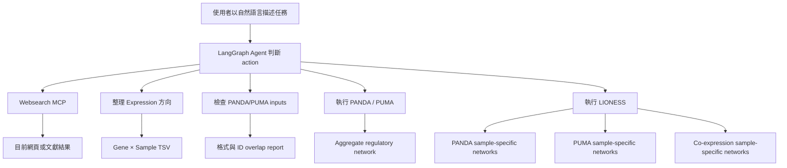

# 新任務完整說明與 Demo 驗證指南

更新日期：2026-07-03

這份文件說明本次四個新任務的目的、實作方式、資料格式，以及如何自己從零
demo 並驗證結果。所有指令都假設目前位於專案根目錄：

```bash
cd "/Users/chenzhonghan/Documents/LLM AGENT/netzoo_agent"
```

---

## 一、這次新任務在做什麼？

原本專案主要可以執行 PANDA，並用 Agent 判斷是否要檢查輸入或執行分析。
這次將能力擴充成四個方向：

1. Agent 能透過 Websearch MCP 搜尋目前網頁或文獻資訊。
2. Agent 能把 expression matrix 的 sample/gene 與 row/column 方向整理成
   PANDA/PUMA 接受的格式。
3. 把 PANDA 已有的檢查與執行流程擴充到 PUMA，並嚴格驗證 miRNA 格式。
4. 實際執行三種 LIONESS：
   - LIONESS-PANDA
   - LIONESS-PUMA
   - LIONESS co-expression

整體流程如下：



---

## 二、開始前的準備

### 2.1 必要工具

- Docker Desktop 已啟動。
- 可以執行 `docker compose`。
- 已有 OpenRouter API key。
- 已有 Tavily API key。

先確認 Docker：

```bash
docker --version
docker compose version
docker info
```

### 2.2 環境變數

專案使用 `.env` 保存本機 key。`.env` 已被 `.gitignore` 排除，不應 commit。

格式如下，請不要把真實 key 貼到 README、程式碼或 Git commit：

```dotenv
OPENROUTER_API_KEY=你的_OpenRouter_key
OPENROUTER_MODEL=openai/gpt-4o-mini

TAVILY_API_KEY=你的_Tavily_key
WEBSEARCH_MCP_URL=https://mcp.tavily.com/mcp

CONTEXT7_API_KEY=你的_Context7_key
CONTEXT7_MCP_URL=https://mcp.context7.com/mcp
```

確認 `.env` 有被 Git 忽略：

```bash
git check-ignore -v .env
```

預期看到：

```text
.gitignore:...:.env
```

### 2.3 建立 Docker image

```bash
docker compose build
```

確認 wrapper 都存在：

```bash
docker compose run --rm netzoo run-panda --help
docker compose run --rm netzoo run-puma --help
docker compose run --rm netzoo run-lioness --help
docker compose run --rm netzoo python scripts/netzoo_agent.py --help
```

---

## 三、任務 1：讓 Agent 能存取 Websearch MCP

### 3.1 目的

LLM 本身不保證知道目前最新資訊，因此加入 Tavily Websearch MCP。Agent 遇到
「搜尋、最新、目前、文獻、web」等明確要求時，可以選擇 `web_search` action。

Websearch 是唯讀能力：

- 可以搜尋目前網頁與文獻資訊。
- 不會執行下載到本機。
- 不會執行搜尋結果中的指令。
- 不會繞過 PANDA/PUMA 的 capability gate。
- 搜尋內容一律視為外部、不受信任的參考資料。

套件文件問題仍優先使用 Context7；一般網頁與文獻搜尋才使用 Websearch。

### 3.2 直接測試 MCP，不經過 LLM

這個測試只驗證 Tavily MCP transport、認證、tool discovery 與搜尋是否成功：

```bash
docker compose run --rm netzoo python -c \
'import scripts.netzoo_agent as a; print(a.query_web_search("netZooPy LIONESS official documentation")[:3000])'
```

成功時應看到：

```text
Websearch MCP result (external, untrusted reference content):
- server: https://mcp.tavily.com/mcp
- query: netZooPy LIONESS official documentation
```

後面應包含 `results`、網頁標題與 URL。

如果只想顯示第一筆乾淨 URL：

```bash
docker compose run --rm netzoo web-url \
  "netZooPy LIONESS official documentation" 2>/dev/null
```

若看到 `401 Unauthorized`：

1. 檢查 `.env` 是否有 `TAVILY_API_KEY`。
2. 檢查 key 是否已過期或被撤銷。
3. 重新執行 `docker compose run`；不必把 key 寫進 image。

### 3.3 透過 Agent 自然語言 demo

```bash
docker compose run --rm netzoo \
  python scripts/netzoo_agent.py \
  --task "請搜尋最新的 LIONESS 與 netZooPy 文件，列出來源網址"
```

這個動作是唯讀搜尋，所以不需要 `--execute`。

成功判準：

- Agent 選到 `web_search`。
- 回答提到 Websearch MCP。
- 回答保留可檢查的來源 URL。
- 不宣稱有執行 PANDA、PUMA 或修改檔案。

---

## 四、任務 2：整理 Expression 的 Sample/Gene 與 Column/Row

### 4.1 PANDA/PUMA 需要的 expression 格式

netZooPy legacy PANDA/PUMA/LIONESS 共用的安全格式是：

- TSV，以 tab 分隔。
- 無 header。
- 每一 row 是一個 gene。
- 第一 column 是 gene ID。
- 後面的 columns 是不同 samples 的 expression value。
- expression value 必須是數字。
- gene ID 不可空白或重複。

正確的 `gene × sample` 範例：

```text
GeneA	1	2	4	8
GeneB	8	5	3	1
GeneC	2	5	4	9
```

意思是：

| Gene | Sample 1 | Sample 2 | Sample 3 | Sample 4 |
|---|---:|---:|---:|---:|
| GeneA | 1 | 2 | 4 | 8 |
| GeneB | 8 | 5 | 3 | 1 |
| GeneC | 2 | 5 | 4 | 9 |

### 4.2 常見但方向相反的輸入

很多原始表格是 `sample × gene`：

```text
sample	GeneA	GeneB	GeneC
S1	1	8	2
S2	2	5	5
S3	4	3	4
S4	8	1	9
```

這時 genes 在 columns、samples 在 rows，必須先轉置。

專案已提供 demo input：

```text
data/format-demo/sample-by-gene.tsv
```

### 4.3 透過 Agent 執行格式整理

`--execute` 很重要；沒有它只會 dry-run，不會寫出檔案。

```bash
docker compose run --rm netzoo \
  python scripts/netzoo_agent.py \
  --execute \
  --task "請把 data/format-demo/sample-by-gene.tsv 整理成 PANDA 格式，genes 在 columns，轉成 gene rows、sample columns，輸出 outputs/demo/expression-formatted.tsv，不要 header"
```

Agent 應選擇：

```text
format_expression
```

### 4.4 驗證整理結果

查看結果：

```bash
sed -n '1,10p' outputs/demo/expression-formatted.tsv
```

預期：

```text
GeneA	1	2	4	8
GeneB	8	5	3	1
GeneC	2	5	4	9
```

與 LIONESS toy expression 比對：

```bash
diff -u \
  data/lioness-toy/expression.tsv \
  outputs/demo/expression-formatted.tsv
```

成功時 `diff` 不會顯示任何差異，exit code 是 0：

```bash
echo $?
```

預期：

```text
0
```

也可以檢查：

```bash
awk -F '\t' '{print "row=" NR, "gene=" $1, "samples=" NF-1}' \
  outputs/demo/expression-formatted.tsv
```

每一列應顯示 `samples=4`。

### 4.5 自動判斷的安全設計

`genes_axis` 支援：

- `rows`：gene 已在 rows。
- `columns`：gene 在 columns，需要轉置。
- `auto`：根據左上角標籤與矩陣形狀判斷。

若矩陣是無標籤方陣，方向可能無法可靠判斷，Agent 會拒絕猜測，要求明確指定
genes 在 rows 或 columns。這是為了避免「程式成功、資料方向卻錯」。

---

## 五、任務 3：把 PANDA 流程擴充到 PUMA，並檢查 miRNA

### 5.1 PANDA 與 PUMA 的差異

| 項目 | PANDA | PUMA |
|---|---|---|
| Expression | gene × sample | gene × sample |
| Regulatory prior | TF-gene motif | TF-gene + miRNA-gene 合併 prior |
| PPI | TF-TF | TF-TF |
| miRNA list | 不需要 | 必須 |
| Output regulator | TF | TF 或 miRNA |

PUMA 不是把 miRNA edges 放進 `-i`。正確方式是：

- `-m`：TF-gene 與 miRNA-gene 合併後的三欄 prior。
- `-i`：只放 miRNA ID，每行一個。

### 5.2 PUMA prior 格式

檔案：

```text
data/lioness-toy/prior-puma.tsv
```

內容：

```text
TF1	GeneA	1
TF1	GeneB	0.5
TF2	GeneB	0.9
TF2	GeneC	0.6
miR-1	GeneA	0.7
miR-1	GeneC	1
```

三欄依序為：

1. Regulator：TF 或 miRNA。
2. Target gene。
3. Prior weight。

### 5.3 miRNA list 正確格式

檔案：

```text
data/lioness-toy/mirna.txt
```

內容：

```text
miR-1
```

規則：

- 無 header。
- 每行恰好一個 miRNA ID。
- 不可有 tab 分隔的 target gene 或 weight。
- 不可有空白行。
- 不可有重複 ID。
- ID 不可包含內部空白。
- 每個 miRNA ID 必須出現在 PUMA prior 第一欄。

下列格式是錯的：

```text
miRNA
miR-1	GeneA	1
```

因為第一行是 header，第二行又是三欄 edge，不是 ID list。

### 5.4 Agent 會做的 PUMA 檢查

- Expression 可讀、數值合法、gene ID 不為空。
- Motif/prior 是三欄 edge list。
- PPI 是三欄 edge list。
- Prior target genes 與 expression genes 有 exact ID overlap。
- Prior 中排除 miRNA 後的 TF 與 PPI TF 有 exact ID overlap。
- 至少有兩個 TF，避免 normalization 產生 NaN。
- miRNA list 通過前述所有格式規則。
- 每個 miRNA 都存在於 prior 第一欄。
- PUMA legacy expression 不可有 header。

### 5.5 用 Agent 只檢查，不執行 PUMA

```bash
docker compose run --rm netzoo \
  python scripts/netzoo_agent.py \
  --task "請檢查 PUMA inputs：expression=data/lioness-toy/expression.tsv，prior=data/lioness-toy/prior-puma.tsv，PPI=data/lioness-toy/ppi.tsv，miRNA=data/lioness-toy/mirna.txt"
```

成功報告應包含：

```text
format: expression matrix
format: edge list
miRNA names overlapping motif/prior regulators: 1/1 (100.0%)
motif TFs overlapping PPI TFs: 2/2 (100.0%)
```

### 5.6 執行 aggregate PUMA

```bash
mkdir -p outputs/demo

docker compose run --rm netzoo run-puma \
  -e data/lioness-toy/expression.tsv \
  -m data/lioness-toy/prior-puma.tsv \
  -p data/lioness-toy/ppi.tsv \
  -i data/lioness-toy/mirna.txt \
  -o outputs/demo/puma.tsv
```

檢查：

```bash
sed -n '1,12p' outputs/demo/puma.tsv
```

每列四欄：

```text
Regulator    Gene    PriorWeight    PumaScore
```

實際檔案沒有 header。應同時看到 `TF1`、`TF2` 與 `miR-1`。

```bash
cut -f1 outputs/demo/puma.tsv | sort -u
```

預期：

```text
TF1
TF2
miR-1
```

---

## 六、任務 4：試跑 LIONESS

### 6.1 LIONESS 是什麼？

PANDA/PUMA aggregate network 使用所有 samples 建立一張總體網路。LIONESS
利用「全部 samples 的網路」與「拿掉某個 sample 後的網路」推估每個 sample
自己的 network。

概念公式：

```text
LIONESS_sample = N × Network_all - (N - 1) × Network_without_sample
```

其中 `N` 是 samples 數。

因此：

- Aggregate PANDA/PUMA：一條 edge 只有一個總體 score。
- LIONESS：同一條 edge 對每個 sample 都有一個 score。
- 至少需要三個 samples，因為 leave-one-out 後仍需至少兩個 samples 計算
  correlation。

### 6.2 Toy data

```text
data/lioness-toy/
├── expression.tsv
├── motif-panda.tsv
├── prior-puma.tsv
├── ppi.tsv
└── mirna.txt
```

Expression 有三個 genes、四個 samples：

```text
GeneA	1	2	4	8
GeneB	8	5	3	1
GeneC	2	5	4	9
```

### 6.3 試跑 LIONESS co-expression

```bash
mkdir -p outputs/demo

docker compose run --rm netzoo run-lioness coexpression \
  -e data/lioness-toy/expression.tsv \
  -o outputs/demo/coexpression.tsv \
  -q outputs/demo/lioness-coexpression.txt
```

產生：

- `coexpression.tsv`：aggregate gene-gene Pearson correlation。
- `lioness-coexpression.txt`：每個 sample 的 gene-gene network。

LIONESS 檔案第一列：

```text
gene1 gene2 1 2 3 4
```

前兩欄是 gene pair，後四欄是四個 sample-specific scores。

### 6.4 試跑 LIONESS-PANDA

```bash
docker compose run --rm netzoo run-lioness panda \
  -e data/lioness-toy/expression.tsv \
  -m data/lioness-toy/motif-panda.tsv \
  -p data/lioness-toy/ppi.tsv \
  -o outputs/demo/panda.tsv \
  -q outputs/demo/lioness-panda.txt
```

產生：

- `panda.tsv`：aggregate PANDA TF-gene network。
- `lioness-panda.txt`：每個 sample 的 TF-gene network。

LIONESS 檔案第一列：

```text
tf gene 1 2 3 4
```

前兩欄是 TF-gene edge，後四欄是 sample-specific scores。

### 6.5 試跑 LIONESS-PUMA

```bash
docker compose run --rm netzoo run-lioness puma \
  -e data/lioness-toy/expression.tsv \
  -m data/lioness-toy/prior-puma.tsv \
  -p data/lioness-toy/ppi.tsv \
  -i data/lioness-toy/mirna.txt \
  -o outputs/demo/puma.tsv \
  -q outputs/demo/lioness-puma.tsv
```

產生：

- `puma.tsv`：aggregate PUMA regulator-gene network。
- `lioness-puma.tsv`：每個 sample 的 regulator-gene network。

PUMA LIONESS 現在會自動補 header：

```text
regulator gene prior_weight 1 2 3 4
```

每列七欄：

1. Regulator。
2. Gene。
3. Prior weight。
4. Sample 1 score。
5. Sample 2 score。
6. Sample 3 score。
7. Sample 4 score。

### 6.6 透過 Agent 執行 LIONESS

若要展示 Agent 自己選工具，可使用：

```bash
docker compose run --rm netzoo \
  python scripts/netzoo_agent.py \
  --execute \
  --task "我要試跑 LIONESS PUMA。expression 是 data/lioness-toy/expression.tsv，prior 是 data/lioness-toy/prior-puma.tsv，PPI 是 data/lioness-toy/ppi.tsv，miRNA 是 data/lioness-toy/mirna.txt，aggregate 輸出 outputs/demo/agent-puma.tsv，LIONESS 輸出 outputs/demo/agent-lioness-puma.tsv"
```

Agent 應選擇：

```text
run_lioness_puma
```

若只是 demo 核心演算法，建議使用前面的 `run-lioness` wrapper，結果較不受
LLM routing 或 OpenRouter 網路狀態影響。

---

## 七、一次驗證全部結果

### 7.1 確認六個輸出存在且非空

```bash
test -s outputs/demo/coexpression.tsv
test -s outputs/demo/lioness-coexpression.txt
test -s outputs/demo/panda.tsv
test -s outputs/demo/lioness-panda.txt
test -s outputs/demo/puma.tsv
test -s outputs/demo/lioness-puma.tsv
echo "all output files exist"
```

### 7.2 檢查有沒有 NaN 或 Inf

```bash
if rg -n -i '(^|[^a-z])(nan|inf)([^a-z]|$)' outputs/demo; then
  echo "FAIL: output contains NaN or Inf"
else
  echo "PASS: no NaN or Inf"
fi
```

預期：

```text
PASS: no NaN or Inf
```

### 7.3 檢查 rows/columns

Co-expression：

```bash
wc -l outputs/demo/coexpression.tsv
wc -l outputs/demo/lioness-coexpression.txt
awk 'NR==1 {print NF}' outputs/demo/lioness-coexpression.txt
```

預期：

- Aggregate：9 data rows。
- LIONESS：10 rows，包含 1 header + 9 gene pairs。
- LIONESS 第一列：6 columns，等於 2 IDs + 4 samples。

PANDA：

```bash
wc -l outputs/demo/panda.tsv
wc -l outputs/demo/lioness-panda.txt
awk 'NR==1 {print NF}' outputs/demo/lioness-panda.txt
```

預期：

- Aggregate：6 edges。
- LIONESS：7 rows，包含 1 header + 6 edges。
- LIONESS 第一列：6 columns，等於 TF + gene + 4 samples。

PUMA：

```bash
wc -l outputs/demo/puma.tsv
wc -l outputs/demo/lioness-puma.tsv
awk -F '\t' 'NR==1 {print NF}' outputs/demo/lioness-puma.tsv
```

預期：

- Aggregate：9 edges。
- LIONESS：9 edges。
- LIONESS：7 columns，等於 3 metadata + 4 samples。

### 7.4 執行自動化測試

```bash
python -m unittest discover -s tests -v
```

目前預期：

```text
Ran 32 tests
OK
```

測試涵蓋：

- Agent capability gate。
- Websearch action routing。
- Expression 轉置與 ambiguous orientation。
- PANDA input 檢查。
- PUMA miRNA list 驗證。
- miRNA/prior ID overlap。
- 三種 LIONESS command。
- LIONESS output 副檔名 gate。
- Co-expression conversion。

---

## 八、如何解讀輸出

### 8.1 Aggregate co-expression

```text
Gene1    Gene2    PearsonCorrelation
```

- 接近 `1`：正相關。
- 接近 `-1`：負相關。
- 接近 `0`：線性相關較弱。

### 8.2 Aggregate PANDA

```text
TF    Gene    MotifPrior    PandaScore
```

- `MotifPrior`：輸入 prior 的 evidence。
- `PandaScore`：PANDA 整合 expression、motif、PPI 後的 edge score。
- score 適合在同一次分析內排序比較，不應直接解讀為機率。

### 8.3 Aggregate PUMA

```text
Regulator    Gene    PriorWeight    PumaScore
```

Regulator 可以是 TF 或 miRNA。PUMA score 是整合 expression、regulatory prior
與 PPI 後的結果。

### 8.4 LIONESS

每個 sample column 是該 sample 的 edge score。可以用於：

- 比較同一條 TF-gene edge 在不同 samples 的差異。
- 比較 miRNA-gene regulation 的 sample specificity。
- 後續分群或 phenotype association。

LIONESS score 不是 expression value，也不是 p-value。

---

## 九、常見錯誤與排除方式

### 9.1 Websearch 顯示 401

原因：Tavily key 沒有傳入或已失效。

```bash
git check-ignore -v .env
docker compose run --rm netzoo bash -lc \
  'if [[ -n "$TAVILY_API_KEY" ]]; then echo "TAVILY_API_KEY is configured"; else echo "TAVILY_API_KEY is missing"; fi'
```

這個指令只回報有無設定，不會輸出實際 key。

### 9.2 Agent 只 dry-run，沒有輸出

原因：沒有加 `--execute`。

解法：

```text
python scripts/netzoo_agent.py --execute --task "..."
```

Websearch 與 Context7 是唯讀查詢，不需要 `--execute`；檔案轉換與分析需要。

### 9.3 Expression 被判定方向不明

原因：方陣或缺乏 gene/sample 標籤。

解法：在 task 中明確寫：

```text
genes 在 columns
```

或：

```text
genes 在 rows
```

### 9.4 PUMA 拒絕 miRNA

依序檢查：

```bash
sed -n '1,20p' data/lioness-toy/mirna.txt
cut -f1 data/lioness-toy/prior-puma.tsv | sort -u
```

miRNA list 中每個 ID 都必須出現在第二個指令的結果中。

### 9.5 PUMA expression header 錯誤

Legacy PUMA/LIONESS 使用無 header expression。先用 `format_expression`
輸出 `with_header=false` 的檔案。

### 9.6 LIONESS samples 太少

至少三個 samples。expression 每列至少需要：

```text
GeneID    Sample1    Sample2    Sample3
```

也就是至少四欄，包含 gene ID。

### 9.7 出現 NaN

常見原因：

- 只有一個 TF。
- PPI 所有值完全相同，沒有變異。
- 某個 gene 在所有 samples 中都是常數。
- leave-one-out 後 samples 太少。

Agent 已提前攔截多數情況，但真實資料仍建議執行 NaN/Inf 檢查。

### 9.8 命令 exit code 0，但找不到輸出

netZooPy legacy 某些輸出格式可能只印 warning。Agent 目前會檢查預期輸出是否
真的被建立或更新，而不只相信 exit code。

---

## 十、建議的現場 Demo 順序

### 10 分鐘版本

1. 用圖說明 Agent 的五條路由。
2. 執行 Websearch MCP 直接測試。
3. 展示 `sample × gene` input。
4. 用 Agent 轉成 `gene × sample`。
5. 用 Agent 檢查 PUMA miRNA 格式。
6. 用 wrapper 跑三種 LIONESS。
7. 執行六個檔案存在檢查。
8. 執行 NaN/Inf 檢查。
9. 展示三種 LIONESS output 的 header/欄位。
10. 執行 unit tests。

### Demo 成功的最低判準

- Websearch MCP 回傳 URL。
- Expression 轉置後與預期檔案完全相同。
- PUMA input report 顯示 miRNA overlap `1/1 (100.0%)`。
- 六個 aggregate/LIONESS 輸出都存在且非空。
- 所有輸出沒有 NaN/Inf。
- Unit tests 顯示 `OK`。

---

## 十一、相關檔案

| 檔案 | 用途 |
|---|---|
| `scripts/netzoo_agent.py` | Agent routing、MCP、格式與分析 tools |
| `docker-compose.yml` | 將 API keys 與 MCP URL 傳入容器 |
| `.env.example` | 環境變數範例，不含真實 key |
| `docker/run-lioness` | 三種 LIONESS wrapper |
| `Dockerfile` | netZooPy image 與 upstream compatibility patch |
| `data/format-demo/sample-by-gene.tsv` | Expression 方向轉換 demo |
| `data/lioness-toy/` | PANDA/PUMA/LIONESS toy inputs |
| `outputs/lioness-toy/` | 已驗證的參考輸出 |
| `tests/test_agent_gate.py` | 自動化驗證 |
| `LIONESS_TRIAL.md` | 2026-07-01 實跑紀錄 |

---

## 十二、完成狀態

- [x] Agent 可連線 Tavily Websearch MCP。
- [x] Tavily key 只存在本機 `.env`，未寫入 tracked files。
- [x] Expression 支援 gene/sample row/column 轉換。
- [x] Ambiguous orientation 不會被默默猜測。
- [x] PANDA input gate 已擴充到 PUMA。
- [x] miRNA list 有嚴格格式與 ID overlap 檢查。
- [x] LIONESS co-expression 實跑成功。
- [x] LIONESS-PANDA 實跑成功。
- [x] LIONESS-PUMA 實跑成功。
- [x] 實跑輸出無 NaN/Inf。
- [x] Docker build 成功。
- [x] 自動化測試通過。
