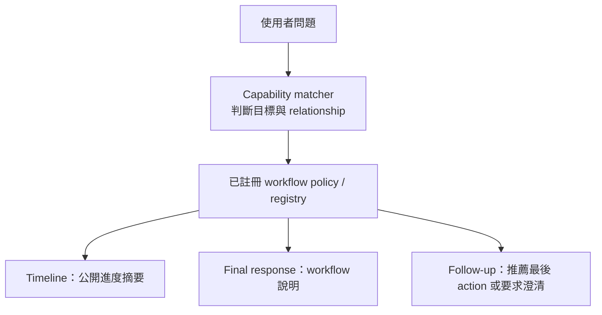

# NetZoo Chat：推理進度與工作流程推薦修正紀錄

更新日期：2026-08-08

範圍：`netzoo-chat` 互動介面、workflow 推薦、後續提示與測試

## 這次完成了什麼

NetZoo Chat 現在會在最終回答前，顯示短而可讀的公開進度摘要；它說明正在判斷什麼、是否需要工具，以及為何選擇某個工作流程。這不是模型的私有 chain-of-thought，而是由已驗證的路由結果、policy 與工具狀態產生的可公開操作說明。

同時，系統已能分辨兩種過去容易混淆的情況：

| 情況 | 行為 |
| --- | --- |
| 多個互斥的可行方法（alternatives） | 列出方法與差異，要求使用者補充必要的科學條件，不擅自選擇。 |
| 必須依序使用的方法（composition） | 以 `A → B` 顯示流程，解釋每一步用途，並把最後一步作為可繼續執行的 workflow。 |

例如，`sample specific mi-RNA regulator network` 會被解讀為：

```text
PUMA → LIONESS-PUMA
```

這表示 PUMA 先建立 aggregate TF/miRNA-to-gene network，LIONESS-PUMA 再據此產生 sample-specific network；兩者不是讓使用者二選一。

## 問題、修正方式與結果

### 1. 原本沒有可理解的 Agent 過程

**問題**：介面只顯示固定 typed state（例如 `Classifying the request`、`NO-TOOL`），使用者看不出 Agent 為什麼不跑工具、如何判斷，或使用了哪些資料來源。

**修正**：加入 timeline presentation mode，將驗證過的 agent state 轉為簡短公開敘事，例如：

```text
[Understanding your request]
  I found a registered workflow composition for this goal: PUMA → LIONESS-PUMA.
```

同時移除 session 初始化、記憶體載入、完成訊號等不利於理解的雜訊。對不需要工具的問題會明確說明「未檢查檔案、未執行分析」。

**為什麼有效**：timeline 讀取的是結構化、受 policy 驗證的事件與決策，而非請 LLM 直接公開內部思考。因此資訊可讀、可測試，也不會暴露不可靠或不應顯示的 private reasoning。

### 2. 基本概念題得到不合理的拒答

**問題**：像「what is the function of PANDA」這類穩定知識題，Agent 曾只說它不支援一般描述。

**修正**：概念回答改從已註冊 workflow specification 讀取 workflow 描述與 required inputs，而非倚賴模型臨時生成。

**結果**：PANDA、PUMA 等已註冊 workflow 的用途會回覆正確、可驗證的說明，並清楚表示沒有執行工具。

### 3. 語意目標只能顯示 action 名稱或錯誤候選

**問題**：使用者用科學目標描述需求時，Agent 早期可能只說「不符合特定工具」，或顯示內部 action 名稱，無法解釋 workflow 的科學差異。

**修正**：Router 可以提供暫時性的 semantic goal、候選 action 與未解決維度；系統會先過濾成 project policy 中已註冊的 action，再以 registry 的 display name 和 description 呈現。

**結果**：介面使用 `LIONESS-PUMA`、`LIONESS-PANDA` 等使用者可讀名稱，而不是 `run_lioness_puma` 這類內部 action ID。

### 4. 將 workflow composition 誤當 alternatives

**問題**：正確拼寫的 miRNA sample-specific 問題曾得到：

```text
PUMA, LIONESS-PUMA
Please clarify which regulatory relationship you want to model.
```

這是不正確的，因為該組合有既定順序，不需在這兩者之間澄清選擇。

**修正**：在 capability matching 層建立 `_GoalCapabilityMatch`，讓每個已辨識目標同時產生：

- `actions`：已註冊 action 的順序；
- `relationship`：`single`、`composition` 或 `alternatives`。

Graph、timeline、final response 與 follow-up prompt 都使用這個關係，而不是僅以「推薦 action 數量大於一」猜測。

**結果**：

- miRNA sample-specific regulation → `PUMA → LIONESS-PUMA`（composition）
- TF sample-specific regulation → `PANDA → LIONESS-PANDA`（composition）
- 僅說 sample-specific regulatory network，卻未指出 TF 或 miRNA → LIONESS-PANDA / LIONESS-PUMA（alternatives，合理要求澄清）

## 執行流程



關鍵點是：workflow 名稱、說明、required inputs 來自 registry/policy；timeline 與回答層只負責呈現這些資料。

## 本輪測試為何代表成功

你最後的測試結果具備所有預期訊號：

1. **判斷正確**：顯示 `PUMA → LIONESS-PUMA`，不是二選一。
2. **過程可見**：在 `[Understanding your request]` 以短區塊說明已識別 workflow composition。
3. **說明正確**：兩個 workflow 的描述來自已註冊的 metadata。
4. **安全邊界正確**：顯示未檢查檔案、未執行分析。
5. **下一步合理**：因 LIONESS-PUMA 是最後的可執行步驟，提示使用者可提供 expression matrix 或回覆 `yes`。

自動驗證結果：`pytest -q` 最終通過 **344 passed、12 skipped**。

## 是否有寫死？新增工具能否有同樣效果？

### 沒有寫死在 UI/回答層的部分

以下內容不是把 `PUMA`、`LIONESS-PUMA` 名稱寫死在介面字串中：

- workflow 的顯示名稱；
- workflow 的描述；
- required inputs；
- workflow composition 中每一步的呈現；
- 最後一步的推薦與 follow-up prompt。

這些都從已註冊的 workflow registry / policy 取得。因此，只要新增 workflow 完成註冊，介面就會以它自己的名稱、描述與輸入欄位呈現，不需要為顯示層重寫程式。

### 新增工具仍必須做的註冊工作

系統不可能只把一個執行函式放進專案，就自動知道它對應哪種科學目標、是否要和其他工具串接。因此新增 workflow 時仍需要在正確的權威層完成以下事項：

1. 在 `scripts/workflow_registry.py` 註冊 action、display name、輸入與執行定義。
2. 在 project policy 註冊 workflow description 與 required/optional inputs。
3. 在 capability matcher 增加該科學目標的辨識規則，並宣告其 relationship：`single`、`composition` 或 `alternatives`。
4. 為新目標新增測試，驗證 timeline、回答與 follow-up 都符合預期。

第 3 點不是 UI 寫死，而是不可避免的領域知識：系統必須有一個可測試、可審查的地方知道「何種使用者目標應選擇何種工具，以及工具之間是替代還是步驟關係」。目前這份知識位於 capability matcher；未來若 workflow 數量增加很多，建議將這些目標與 relationship 移到 declarative policy/registry 設定檔，讓新增工具不需改 Python 邏輯。

## 相關程式位置

- `scripts/netzoo_agent_core/presentation.py`：timeline 的顯示。
- `scripts/netzoo_agent_core/graph/routing_planning.py`：將目標匹配結果帶入 agent state。
- `scripts/netzoo_agent_core/routing/capability.py`：確定性目標匹配與 relationship 判斷。
- `scripts/netzoo_agent_core/interpretation/semantic_goal.py`：將 action ID 轉為 registry workflow 名稱的公開摘要。
- `scripts/netzoo_agent_core/interpretation/concept_answers.py`：registry/policy 驅動的概念、alternatives 與 composition 回答。
- `scripts/netzoo_agent_core/cli/follow_up.py`：下一輪提示與最後 action 的延續。

## 相關提交

- `1b6e35e`、`8185dd6`、`a53083b`：建立並啟用 timeline。
- `fe3235d`：移除不必要的 timeline 雜訊。
- `e368ffd`、`adf20cf`：從 workflow specification 回答穩定概念題。
- `57af59c`、`b33a564`、`1dd3809`：加入自然語言公開進度與 typed semantic goal。
- `64a7647`、`e1d9b49`：遇到真正 alternatives 時要求澄清。
- `a8d4174`：以 registry 驅動 narrative 顯示。
- `b3b96b2`：區分 workflow composition 與 alternatives。
- `4cf608e`：將 relationship 判斷固定在 capability matcher，避免 LLM 候選欄位造成誤判。
