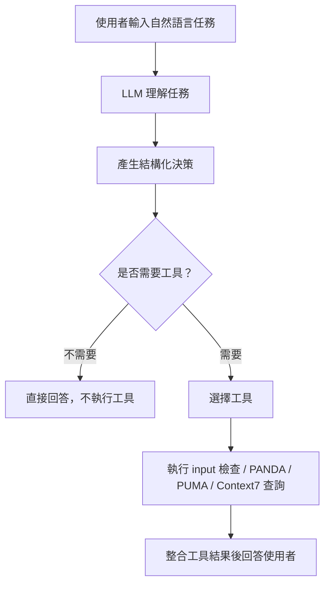

# 歷史文件：Network Zoo PANDA / PUMA Docker 與 LLM Agent 專案整理

> 本文件整理目前專案已完成的功能、使用方式，以及為什麼這樣設計可以成功執行。  
> 主要目標是讓使用者可以用 Docker 穩定執行 PANDA / PUMA，並進一步透過 LLM Agent 判斷是否需要使用工具。

---

## 1. 使用 Dockerfile 建立可執行 PANDA / PUMA 的環境

### 目標

PANDA / PUMA 屬於 netZooPy 相關工具，執行時需要 Python、conda、netZooPy，以及多個科學運算套件。  
如果直接在本機安裝，容易遇到版本不相容、套件衝突，或換電腦後無法重現的問題。

因此本專案先建立 Docker 環境，讓 PANDA / PUMA 可以在固定環境中執行。

### 建立的檔案

本專案建立了以下 Docker 相關檔案：

```text
Dockerfile
environment.yml
docker-compose.yml
docker/run-panda
docker/run-puma
```

各檔案功能如下：

| 檔案 | 功能 |
|---|---|
| `Dockerfile` | 定義 Docker image 如何建立 |
| `environment.yml` | 定義 conda / Python 套件環境 |
| `docker-compose.yml` | 簡化 Docker 啟動方式，並掛載本機資料夾 |
| `docker/run-panda` | 封裝 PANDA 執行指令 |
| `docker/run-puma` | 封裝 PUMA 執行指令 |

### 為什麼要用 Docker？

Docker 的角色是把執行環境包起來：

```text
Python 版本
conda 環境
netZooPy
numpy / pandas / scipy 等依賴套件
PANDA / PUMA wrapper
```

這樣可以避免：

- 本機 Python 版本不同造成錯誤
- 套件版本衝突
- 換電腦後無法重現
- 安裝過程污染原本電腦環境

在本專案中，`docker-compose.yml` 會把目前專案資料夾掛載到 container 的 `/work`。  
所以 container 產生的 output 仍會留在本機的 `outputs/` 資料夾中。

### 使用官方 toy/example data 測試

目前已加入 netZooPy 官方 toy data：

```text
data/official-toy/ToyExpressionData.txt
data/official-toy/ToyMotifData.txt
data/official-toy/ToyPPIData.txt
data/official-toy/ToyMiRList.txt
```

這些資料可用來確認環境是否正確，不需要一開始就使用正式研究資料。

### 建立 Docker image

```bash
docker compose build
```

### 執行 PANDA example

```bash
docker compose run --rm \
  netzoo python scripts/netzoo_agent.py \
  --execute \
  --task "我要跑 PANDA，expression 是 data/official-toy/ToyExpressionData.txt，motif 是 data/official-toy/ToyMotifData.txt，PPI 是 data/official-toy/ToyPPIData.txt，輸出 outputs/panda_official_toy.txt"
```

### 執行 PUMA example

```bash
docker compose run --rm \
  netzoo python scripts/netzoo_agent.py \
  --execute \
  --task "我要跑 PUMA，expression 是 data/official-toy/ToyExpressionData.txt，motif 是 data/official-toy/ToyMotifData.txt，PPI 是 data/official-toy/ToyPPIData.txt，miRNA 是 data/official-toy/ToyMiRList.txt，輸出 outputs/puma_official_toy.txt"
```

### 為什麼可以成功？

因為目前已確認：

- Docker image 可以成功 build
- netZooPy 相關套件已安裝在 container 中
- 官方 toy data 已放入專案
- PANDA / PUMA 所需 input 路徑完整
- container 內的 `/work` 對應到本機專案資料夾
- output 可寫回本機 `outputs/`

---

## 2. 撰寫 Python Script：由使用者描述任務，LLM 判斷要不要使用工具

### 目標

原本一般 Python script 通常是固定流程，例如：

```text
讀取參數 → 執行 PANDA
```

但本專案希望使用者可以用自然語言描述任務，例如：

```text
請檢查 PANDA inputs，expression 是 data/official-toy/ToyExpressionData.txt，motif 是 data/official-toy/ToyMotifData.txt，PPI 是 data/official-toy/ToyPPIData.txt
```

然後由 LLM 判斷：

- 這是不是 PANDA / PUMA 能處理的任務？
- 是否需要呼叫工具？
- 如果要呼叫工具，應該呼叫哪一個？
- 如果不需要工具，是否應該只回答文字？

### Agent 使用的技術

本專案使用：

| 技術 | 功能 |
|---|---|
| OpenRouter | 提供 LLM API |
| LangChain | 包裝 LLM 與工具 |
| LangGraph | 建立 Agent 流程 |
| Pydantic | 定義 LLM 輸出的決策格式 |
| Python tools | 實際檢查 input 或執行 PANDA / PUMA |

### Agent 的基本流程



### 可選擇的工具

目前 Agent 可以選擇：

| 工具 | 說明 |
|---|---|
| `no_tool` | 不執行任何工具，只回答問題 |
| `inspect_inputs` | 檢查 PANDA / PUMA input 檔案是否合理 |
| `run_panda` | 執行 PANDA regulatory network inference |
| `run_puma` | 執行 PUMA regulatory network inference |
| `query_context7` | 查詢 Context7 MCP 文件 |

### 為什麼需要 `no_tool`？

不是所有使用者任務都應該執行工具。

例如：

```text
PANDA 是什麼？
```

這種問題只需要文字說明，不需要真的跑 PANDA。

又例如：

```text
幫我找基因突變
```

雖然這是生物資訊相關任務，但它不是 PANDA / PUMA 的功能。  
因此 Agent 應該回覆「這不在目前工具能力內」，並且不執行任何工具。

---

## 3. 改進 Python Script：只有任務真的符合工具能力時才執行

### 改進原因

LLM 可能會誤判任務。  
例如使用者說：

```text
幫我使用工具找到基因突變
```

如果 Agent 太自由，LLM 可能錯誤選到 PANDA 或 PUMA。  
但事實上 PANDA / PUMA 是用來推論 regulatory network，不是找 mutation。

因此本專案加入 capability gate，讓工具執行前再被嚴格檢查一次。

### Capability gate 的概念

Capability gate 是工具執行前的安全檢查。  
它會確認：

1. 使用者任務是否明確屬於 PANDA / PUMA 能力範圍
2. 是否有明確提到 `PANDA` 或 `PUMA`
3. 是否提供必要 input 檔案路徑
4. LLM 信心分數是否足夠
5. 是否屬於禁止執行的生物資訊任務

### 被禁止自動執行的任務

以下任務即使是生物資訊相關，也不會執行 PANDA / PUMA：

- 找基因突變 / variant calling
- sequence alignment
- differential expression
- enrichment analysis
- raw FASTQ preprocessing
- protein structure prediction
- literature search
- 天氣、日常問題或與本專案無關的任務

### 預設不真正執行工具

本專案設計成：

- 沒有加 `--execute`：只判斷會做什麼，不真的執行
- 有加 `--execute`：才真的執行 PANDA / PUMA

這樣可以避免 LLM 誤解任務時直接執行耗時分析或覆蓋 output。

### 不執行，只檢查 Agent 判斷

```bash
docker compose run --rm \
  netzoo python scripts/netzoo_agent.py \
  --task "我要用 data/expression.tsv data/motif.tsv data/ppi.tsv 跑 PANDA，輸出 outputs/panda.tsv"
```

### 真正執行工具

```bash
docker compose run --rm \
  netzoo python scripts/netzoo_agent.py \
  --execute \
  --task "我要用 data/expression.tsv data/motif.tsv data/ppi.tsv 跑 PANDA，輸出 outputs/panda.tsv"
```

### 測試不應該執行工具的例子

```bash
docker compose run --rm \
  netzoo python scripts/netzoo_agent.py \
  --task "幫我使用工具找到基因突變"
```

預期結果：

```text
不執行工具，因為 mutation / variant calling 不是 PANDA / PUMA 的功能。
```

### 為什麼這樣可以成功？

因為工具執行不是只依賴 LLM 的單次回答，而是採用兩層判斷：

```text
LLM 初步理解任務
        ↓
Capability gate 再次檢查
        ↓
只有符合條件才執行工具
```

因此即使 LLM 有模糊判斷，也能被 capability gate 擋下來。

---

## 4. 讓 Agent 能存取 Context7 MCP

### 目標

套件文件、API、參數格式可能會更新。  
如果 Agent 只依賴訓練資料，可能會回答過時資訊。

因此本專案加入 Context7 MCP，讓 Agent 在需要文件資訊時，可以查詢較新的官方文件內容。

### Context7 MCP 在本專案中的角色

Context7 是文件查詢工具，不是生物資訊分析工具。

它可以用來查：

- LangChain 文件
- LangGraph 文件
- Pydantic 文件
- pandas 文件
- OpenRouter 或其他已被 Context7 收錄的套件文件
- 未來若 netZooPy 被 Context7 收錄，也可查詢 netZooPy 文件

它不能用來：

- 執行 PANDA
- 執行 PUMA
- 找突變
- 分析 FASTQ
- 自動修改專案

### 整合方式

本專案加入：

```text
langchain-mcp-adapters
```

並透過環境變數設定 Context7 MCP：

```bash
CONTEXT7_MCP_URL=https://mcp.context7.com/mcp
CONTEXT7_API_KEY=ctx7-your-key-here
```

其中 `CONTEXT7_API_KEY` 不是必填，但建議設定，可以提高 rate limit。

### 使用 `.env` 管理 API key

為了避免每次都手動 export，本專案可使用 `.env`：

```bash
cp .env.example .env
```

接著在 `.env` 裡填入：

```text
OPENROUTER_API_KEY=sk-or-v1-your-real-key
OPENROUTER_MODEL=openai/gpt-4o-mini
CONTEXT7_API_KEY=ctx7-your-key-here
CONTEXT7_MCP_URL=https://mcp.context7.com/mcp
```

`.env` 已加入 `.gitignore`，避免 API key 被上傳到 GitHub。

### Agent 什麼時候會使用 Context7？

使用者不需要明確說「請使用 Context7」。  
只要問題像是在問文件、API、版本、參數、安裝、錯誤排除，Agent 就可以自動選擇 Context7。

例如：

```text
LangGraph structured output 現在應該怎麼用？
```

或：

```text
PUMA 的 -i 參數應該放什麼格式？
```

### 測試 Context7 MCP

可以用已確認 Context7 有收錄的套件測試，例如 LangGraph：

```bash
docker compose run --rm \
  netzoo python scripts/netzoo_agent.py \
  --task "請查詢 LangGraph structured output 現在應該怎麼使用"
```

如果能回傳 Context7 文件來源與整理內容，代表 MCP 整合正常。

### netZooPy 的限制

目前測試時，Context7 尚未收錄 `netZooPy`。  
因此 Agent 可以連上 Context7，但查詢 `netZooPy` 時可能會得到：

```text
Context7 could not resolve a library ID.
No libraries found for netZooPy.
```

這代表：

- 不是 Agent 沒接上 Context7
- 不是 Docker 壞掉
- 而是 Context7 目前沒有該套件的索引

未來如果 netZooPy 被加入 Context7，Agent 不需要大幅修改，就可以開始查詢。

### 為什麼這樣可以成功？

因為 Context7 MCP 被設計成唯讀文件來源。  
它只負責查文件，不會直接執行分析工具，也不會繞過 capability gate。

整體安全邏輯是：

```text
一般問題 → LLM 直接回答
文件問題 → Context7 查文件後回答
PANDA/PUMA 任務 → capability gate 通過後才執行
無關或超出能力任務 → 不執行工具
```

---

## 5. 目前完整使用流程

### 第一次設定

```bash
cd "/Users/chenzhonghan/Documents/LLM AGENT/network-zoo-panda-puma"
cp .env.example .env
```

在 `.env` 填入 OpenRouter key：

```text
OPENROUTER_API_KEY=sk-or-v1-your-real-key
OPENROUTER_MODEL=openai/gpt-4o-mini
```

建立 Docker image：

```bash
docker compose build
```

### 檢查 PANDA input

```bash
docker compose run --rm \
  netzoo python scripts/netzoo_agent.py \
  --task "請檢查 PANDA inputs，expression 是 data/official-toy/ToyExpressionData.txt，motif 是 data/official-toy/ToyMotifData.txt，PPI 是 data/official-toy/ToyPPIData.txt"
```

### 執行 PANDA

```bash
docker compose run --rm \
  netzoo python scripts/netzoo_agent.py \
  --execute \
  --task "我要跑 PANDA，expression 是 data/official-toy/ToyExpressionData.txt，motif 是 data/official-toy/ToyMotifData.txt，PPI 是 data/official-toy/ToyPPIData.txt，輸出 outputs/panda_official_toy.txt"
```

### 執行 PUMA

```bash
docker compose run --rm \
  netzoo python scripts/netzoo_agent.py \
  --execute \
  --task "我要跑 PUMA，expression 是 data/official-toy/ToyExpressionData.txt，motif 是 data/official-toy/ToyMotifData.txt，PPI 是 data/official-toy/ToyPPIData.txt，miRNA 是 data/official-toy/ToyMiRList.txt，輸出 outputs/puma_official_toy.txt"
```

### 測試不該執行的任務

```bash
docker compose run --rm \
  netzoo python scripts/netzoo_agent.py \
  --task "幫我使用工具找到基因突變"
```

預期：Agent 不會執行 PANDA / PUMA。

---

## 6. 總結

目前專案完成了四個主要部分：

1. **建立 Docker 環境執行 PANDA / PUMA**
   - 解決環境與套件版本問題
   - 可使用官方 toy data 測試

2. **建立 Python LLM Agent**
   - 使用者可用自然語言描述任務
   - LLM 判斷要使用哪個工具，或不使用工具

3. **改進 Agent 的安全執行邏輯**
   - 加入 capability gate
   - 不符合 PANDA / PUMA 能力的任務不執行
   - 預設不真正執行，需加 `--execute`

4. **整合 Context7 MCP**
   - 讓 Agent 可查詢較新的套件文件
   - 文件查詢與分析工具分離
   - 不會繞過工具安全限制

整體來說，這個專案不是單純把 PANDA / PUMA 包進 Docker，而是進一步建立一個「會判斷任務、會拒絕不適合任務、需要時才執行工具」的 LLM Agent 工作流程。
