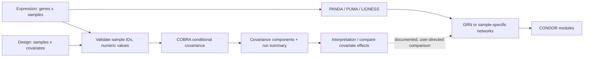

# COBRA First and netZooPy Capability Roadmap

## Goal

Extend `netzoo_agent` from its current PANDA/PUMA/LIONESS/CONDOR focus into a
safe, composable NetZoo analysis assistant. The first shippable workflow is
COBRA; remaining netZooPy modules are introduced in evidence-driven releases
instead of exposing an unvalidated collection of commands.

The official netZooPy source tree currently contains `bonobo`, `cobra`,
`condor`, `dragon`, `giraffe`, `lioness`, `otter`, `panda`, `puma`, and
`sambar`. The upstream README describes the supported feature set as
(gpu)PANDA, (gpu)LIONESS, (gpu)PUMA, SAMBAR, CONDOR, OTTER, DRAGON, COBRA, and
BONOBO. Treat GIRAFFE as a discovery spike until its public API, input contract,
and maintenance status have been verified.

## Current baseline

- Implemented workflows: PANDA, PUMA, LIONESS-PANDA, LIONESS-PUMA,
  LIONESS co-expression, and CONDOR.
- Every executable workflow is represented consistently in a YAML specification,
  `scripts/workflow_registry.py`, typed policy contracts, planner/evaluator,
  allow-listed executor, artifact validation, routing, and tests.
- The Docker image pins netZooPy to commit `60bcaf5ac69ac8f002db5fc6b1b10cbc101ee822`.
  All API investigation and acceptance tests must use that exact revision first;
  do not design against `master` and silently execute a different revision.

## Scientific and product boundary

COBRA accepts an expression matrix with genes in rows and samples in columns,
plus a sample-by-covariate design matrix. Its `cobra(X, expression)` API returns
a covariance decomposition (`psi`, `Q`, `d`, `g`) that represents
covariate-associated co-expression. It is not a drop-in expression-matrix
transform. Therefore version 1 must **not** automatically feed a COBRA result to
PANDA, PUMA, or LIONESS, whose current wrappers expect expression data. The
agent may explain the relationship and recommend a comparison, but cannot claim
that COBRA has batch-corrected an expression input for downstream GRN inference.

This constraint prevents a biologically misleading pipeline. Any later
COBRA-to-GRN bridge must be a separately specified method with an upstream
reference, explicit assumptions, and empirical tests.

## Product architecture



## Phase 0 — upstream compatibility spike

**Purpose:** remove API and output-format uncertainty before changing the agent.

1. In the pinned Docker image, inspect `netZooPy/cobra/cobra.py`, import the
   public callable, and run its smallest official or synthetic example.
2. Record the exact callable signature, expected NumPy shapes, return value
   shapes, numerical dependencies, error modes, and memory footprint in
   `COBRA_TRIAL.md`.
3. Decide the user-facing input format:
   - expression TSV/CSV: first column gene ID; remaining columns sample IDs;
   - design TSV/CSV: first column sample ID; remaining columns numeric or
     explicitly encoded covariates;
   - all design sample IDs must exactly match expression sample IDs after an
     intentional ordering reconciliation.
4. Add a tiny reproducible fixture with at least two covariates and enough
   samples to make the selected COBRA mode meaningful. Do not use the existing
   PANDA toy inputs unless they carry real sample headers and a matching design.
5. Make no agent capability public in this phase. A failing or unstable upstream
   API stops the rollout here and produces an evidence note rather than a
   guessed wrapper.

**Acceptance:** `COBRA_TRIAL.md` contains exact command, pinned revision,
validated shapes, artifacts, and observed limitations; the trial is repeatable
in Docker.

## Phase 1 — COBRA core workflow

### 1. Data contracts and validation

Add focused owners below `scripts/netzoo_agent_core/data/`:

- `cobra.py`: parse expression/design tables, normalize delimiters, reconcile
  sample order, validate numeric covariates, reject duplicate/blank IDs and
  rank-deficient or undersized design matrices, and create a compact validation
  report.
- `paths.py`: define deterministic, collision-safe paths for a COBRA output
  directory and manifest; never overwrite inputs.
- `artifacts.py`: validate the manifest, numerical array metadata, summary TSV,
  and only those matrix exports explicitly requested by the user.

Use a new validation action, `inspect_cobra_inputs`; do not overload
`inspect_inputs`, which encodes TF-motif-PPI identifier rules.

### 2. Serializable output contract

Add a container wrapper, `docker/run-cobra`, calling a small project-owned
adapter rather than exposing arbitrary Python arguments. Its output directory
contains:

- `manifest.json`: input paths, pinned netZooPy revision, dimensions, covariate
  names, sample-order mapping, selected options, and file checksums;
- `components.npz`: the complete numerical COBRA return values, preserving
  precision without an enormous TSV;
- `summary.tsv`: component-level, human-readable statistics and diagnostics;
- optional `component-<name>.tsv`: a labeled covariance export only when the
  user requests it and it is within the configured size limit.

This distinguishes reproducible machine artifacts from readable agent output,
and keeps large gene-by-gene matrices out of terminal timelines by default.

### 3. Registry, policy, planning, execution, and interpretation

Add `run_cobra` consistently to:

- `scripts/workflow_registry.py`: action type, required
  `expression_file`, `design_file`, `output_dir`; constrained optional output
  component/export flags; validation action; `analyze` output capability for a
  `coexpression_network` / covariance artifact.
- `scripts/netzoo_agent_core/contracts/decisions.py`: typed COBRA fields.
- `scripts/netzoo_agent_core/contracts/policy.py` and `workflows/cobra.yaml`:
  matching policy schema and versioned workflow contract.
- `scripts/netzoo_agent_core/execution.py`: `run_cobra` allow-listed adapter and
  `LOCAL_TOOL_EXECUTORS` entry.
- routing, extraction, discovery, defaults, evaluation rendering, artifact
  validation, memory normalization, and result-path selection: add explicit
  COBRA cases rather than relying on string-prefix fallbacks.

Routing language must distinguish these goals:

- “remove/inspect covariate effects in correlation structure” → COBRA;
- “infer TF–gene regulation” → PANDA/PUMA;
- “sample-specific co-expression” → LIONESS co-expression or BONOBO when
  supported.

The final response describes which covariates were modeled and which artifacts
were generated. It must not overstate causality or report a component as a
biologically corrected GRN.

### 4. Tests and documentation

Add tests for malformed tables, missing/extra sample IDs, reordered matching
samples, duplicate IDs, nonnumeric covariates, invalid design dimensions,
output collisions, correct command construction, preview-only behavior,
artifact validation, and routing/capability matching. Extend the existing
registry-policy parity tests so a new workflow cannot be added to only one
layer.

Document the input templates, the scientific boundary, artifacts, demo command,
and interpretation caveats in `README.md`, `AGENT_USAGE.md`, and
`COBRA_TRIAL.md`.

**Phase-1 acceptance:** all tests pass; `docker compose build` succeeds; the
COBRA fixture completes in `/execute` mode; preview mode produces no artifacts;
the manifest and outputs pass validation; a PANDA request is not silently
rerouted through COBRA.

## netZooPy expansion order

| Priority | Module | Agent capability | Why this order | Release condition |
|---|---|---|---|---|
| Now | COBRA | Covariate-aware covariance analysis | Complements all expression-based work without duplicating a current method. | Complete Phase 1. |
| Next | BONOBO | Bayesian sample-specific co-expression | Natural comparison to current LIONESS co-expression; supports an explicit method choice rather than hidden substitution. | Memory/storage budget for one matrix per sample, sparse output policy, and a benchmark against LIONESS. |
| Then | DRAGON | Two-omic Gaussian graphical network | Adds genuine multi-omics capability and a clear input contract. | Two matched omics fixtures, feature-set validation, and an interpretation/reporting design for cross-layer edges. |
| Then | OTTER | Alternative aggregate TF–gene GRN | Reuses motif/PPI/co-expression concepts while offering a distinct inference method. | Robust NA/intersection preflight, because upstream warns about its simple merging/reading path. |
| Later | SAMBAR | Mutation-pathway cancer subtyping | Valuable but a separate mutation/pathway domain, so it should not complicate expression/GRN routing early. | Curated pathway-file provenance, phenotype safeguards, and subtype stability reporting. |
| Research only | GIRAFFE | Undecided | It appears in the source tree but not in the upstream README feature list. | Verify API, intended use, maintained tests, and a real user workflow before commitment. |

gpuPANDA/gpuPUMA/gpuLIONESS are execution profiles of already supported
methods, not new scientific workflows. Add them only after a benchmark proves
that GPU availability, numerical parity, and workload size justify the extra
operations surface.

## Cross-module efficiency rules

1. Create a reusable `DatasetManifest` / `SampleAlignment` contract before
   BONOBO and DRAGON, but only after COBRA establishes the minimal real need.
   It should record entity axis, identifiers, sample ordering, source files,
   transformations, and compatibility evidence once per bundle.
2. Keep each method a separate typed action. A high-level “analysis recipe” may
   compose validated actions only after it has its own policy, provenance
   manifest, intermediate-artifact checks, and stop/clarification behavior.
3. Store large matrices as binary artifacts plus manifests; terminal replies and
   memory episodes retain only paths, dimensions, checksums, summary metrics,
   and methodological choices.
4. Keep upstream code pinned. Updating netZooPy is a dedicated compatibility
   task that reruns every supported method's fixtures, not an incidental Docker
   rebuild.

## Verification matrix

Run during implementation:

```bash
python -m unittest discover -s tests -p 'test_*.py'
docker compose build
docker compose run --rm netzoo run-cobra --help
docker compose run --rm netzoo python scripts/netzoo_agent.py --policy-status
docker compose run --rm netzoo python scripts/netzoo_agent.py --task "Analyze covariate-associated co-expression with COBRA using data/cobra-toy/expression.tsv and data/cobra-toy/design.tsv"
```

Then test the interactive `/planning` and `/execute` paths separately using the
fixture. The former must only show a validated command preview; the latter must
create the declared output directory and pass artifact validation.

## Risks and decisions

- **Statistical validity:** a covariate matrix can encode confounding rather
  than a biologically meaningful effect. Require the agent to report modeled
  columns and avoid causal language.
- **Scale:** gene-by-gene matrices grow quadratically. Default to compressed
  binary components and summaries; make labeled matrix exports opt-in.
- **API drift:** use the Docker-pinned revision as the compatibility target and
  record it in every run manifest.
- **Workflow ambiguity:** COBRA, LIONESS, and BONOBO all involve co-expression
  but answer different questions. Resolve ambiguity with one concise question
  rather than selecting a method based solely on a keyword.

## Sources consulted

- [netZooPy source-module tree](https://github.com/netZoo/netZooPy/tree/master/netZooPy)
- [netZooPy upstream README](https://github.com/netZoo/netZooPy)
- [COBRA project and minimal Python example](https://github.com/QuackenbushLab/cobra-experiments)
